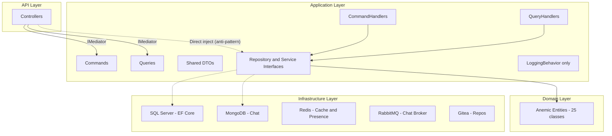
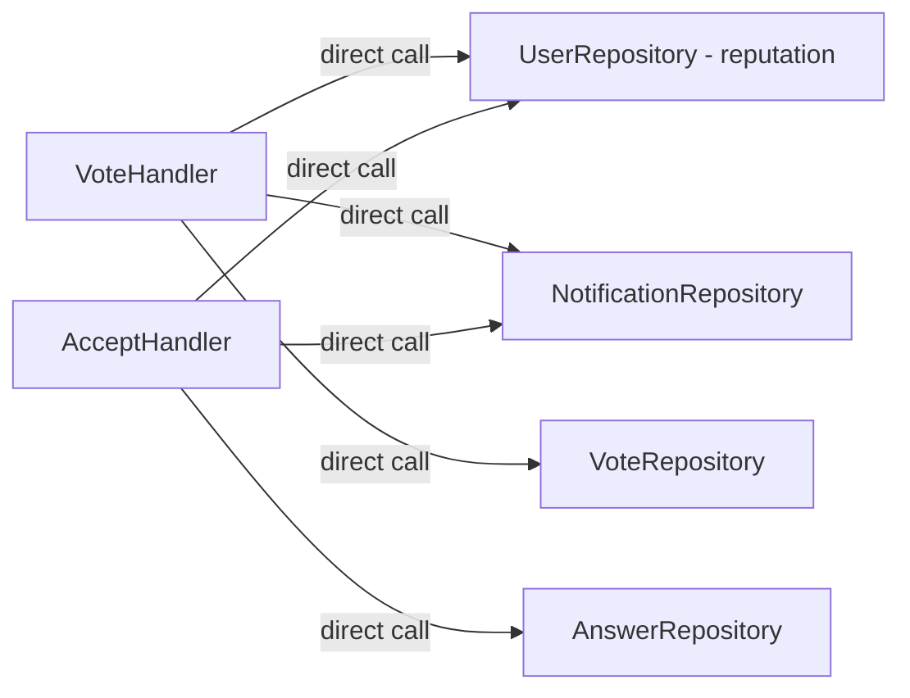
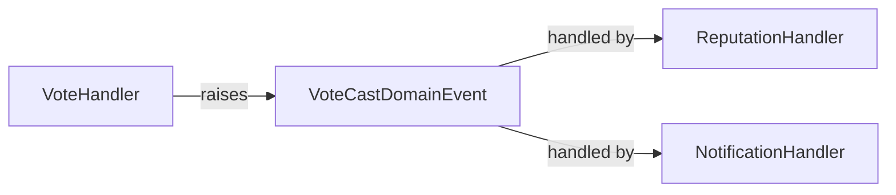
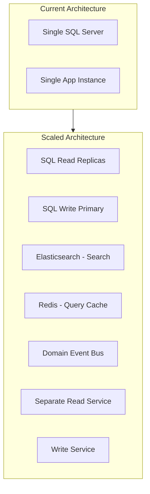

# CQRS Application Layer Audit -- SocialTechsy Social Network

---

## 1. Architecture Overview (Actual vs. Claimed)




**Actual counts vs. claimed:**


| Area               | Claimed | Actual  | Notes                                                 |
| ------------------ | ------- | ------- | ----------------------------------------------------- |
| Commands           | ~30     | **40**  | Includes Chat (8), SavedItems (4), Repos (3), etc.    |
| Queries            | ~20     | **23**  | Includes Chat (4), Users (5), Repos (3)               |
| Handlers (Cmd)     | --      | 29      | Across 17 files                                       |
| Handlers (Qry)     | --      | 16      | Across 12 files                                       |
| DTOs               | 13      | **30+** | 13 named DTO files, but many contain multiple classes |
| Repo Interfaces    | 18      | 18      | Correct                                               |
| Service Interfaces | 4       | **5**   | +IChatMessageBroker, IPasswordHasher                  |


---

## 2. CQRS Evaluation

### 2.1 What works well

- **Clear Command/Query separation in folder structure:** Dedicated `Commands/`, `CommandHandlers/`, `Queries/`, `QueryHandlers/` folders with domain-based subfolders.
- **MediatR integration:** Commands and queries are dispatched through `IMediator`, decoupling controllers from handlers.
- **Consistent pagination model:** `PaginatedResponse<T>` is well-structured with proper metadata (TotalPages, HasPrevious, HasNext).
- **Polyglot persistence:** Chat on MongoDB, core data on SQL Server, caching on Redis, messaging on RabbitMQ -- each store suited to its workload.

### 2.2 CQRS violations

**CRITICAL -- Commands return data (breaks CQS principle):**

Almost every command returns a value. In strict CQRS, commands mutate state and return nothing; the caller re-queries to get the new state.


| Command                 | Returns                                          | Strict CQRS                                          |
| ----------------------- | ------------------------------------------------ | ---------------------------------------------------- |
| `LoginCommand`          | `AuthResponse` (token + user)                    | Acceptable exception (auth is inherently query-like) |
| `CreateQuestionCommand` | `QuestionDto`                                    | Should return `int` (ID) at most, or `Unit`          |
| `CreateAnswerCommand`   | `AnswerDto?`                                     | Same                                                 |
| `UpdateQuestionCommand` | `bool`                                           | Should return `Unit` and throw on failure            |
| `DeleteQuestionCommand` | `bool`                                           | Same                                                 |
| `VoteQuestionCommand`   | `VoteResult` (score + notification)              | Over-returns; score is a query concern               |
| `AcceptAnswerCommand`   | `AcceptAnswerResult` (with Notification entity!) | Leaks domain entity through return type              |
| `SaveQuestionCommand`   | `bool`                                           | Should be `Unit`                                     |


**Key file references:**

- Commands returning DTOs: [CreateQuestionCommand.cs](backend/src/SocialTechsy.SocialNetwork.Application/Commands/Questions/CreateQuestionCommand.cs) line 10: `IRequest<QuestionDto>`
- VoteResult leaking Notification entity: [VoteCommandHandlers.cs](backend/src/SocialTechsy.SocialNetwork.Application/CommandHandlers/Votes/VoteCommandHandlers.cs) line 298: `public Notification? CreatedNotification`
- AcceptAnswerResult leaking Notification entity: [AnswerCommandHandlers.cs](backend/src/SocialTechsy.SocialNetwork.Application/CommandHandlers/Answers/AnswerCommandHandlers.cs) line 202: `public Notification? CreatedNotification`

---

## 3. Anti-Patterns Identified

### 3.1 CRITICAL -- Anemic Domain Model

The Domain Layer contains 25 entity classes that are pure data containers with zero behavior. All business logic lives in command handlers.

Example -- creating a question in the handler:

```csharp
// Handler creates entity directly -- no domain logic
var question = new Question
{
    Title = request.Title,
    Body = request.Body,
    UserId = request.UserId,
    CreatedDate = DateTime.UtcNow,   // should be set by entity
    Status = "open",                 // magic string
    ViewCount = 0,
    Score = 0
};
```

**Should be:**

```csharp
var question = Question.Create(request.Title, request.Body, request.UserId);
// Entity internally sets CreatedDate, Status, ViewCount, Score
// Entity raises QuestionCreatedDomainEvent
```

### 3.2 CRITICAL -- No Transaction Boundaries

Handlers perform multiple repository operations without explicit transactions. If any step fails, the system is left in an inconsistent state.

Worst example -- `AcceptAnswerCommandHandler` (4 independent writes, no transaction):

```
1. answerRepository.AcceptAnswerAsync(...)       // marks answer accepted
2. userRepository.UpdateReputationAsync(...)     // +15 to answer author
3. userRepository.UpdateReputationAsync(...)     // +2 to question owner
4. notificationRepository.AddAsync(...)          // creates notification
```

If step 2 succeeds but step 3 fails, reputation is inconsistent.

### 3.3 CRITICAL -- No Validation Pipeline

FluentValidation is not installed. Validation relies entirely on `[DataAnnotation]` attributes checked via `ModelState.IsValid` in controllers. This means:

- Handlers have no input validation guard
- Direct MediatR calls bypass validation entirely
- No centralized validation error reporting

### 3.4 HIGH -- Duplicate/Orphaned Commands

`VoteQuestionCommand` exists in TWO locations:

- [Commands/Questions/VoteQuestionCommand.cs](backend/src/SocialTechsy.SocialNetwork.Application/Commands/Questions/VoteQuestionCommand.cs) -- **no IRequest, dead code**
- [Commands/Votes/VoteCommands.cs](backend/src/SocialTechsy.SocialNetwork.Application/Commands/Votes/VoteCommands.cs) -- active, implements `IRequest<VoteResult>`

Same for `VoteAnswerCommand` which appears as dead code in [AnswerCommands.cs](backend/src/SocialTechsy.SocialNetwork.Application/Commands/Answers/AnswerCommands.cs) line 60.

### 3.5 HIGH -- Broken Query

`GetUserByUsernameQuery` does not implement `IRequest<>`, making it impossible to dispatch through MediatR:

```csharp
// Missing: IRequest<UserDto?>
public class GetUserByUsernameQuery   // BROKEN -- can't be dispatched
{
    public string Username { get; set; } = null!;
}
```

### 3.6 HIGH -- Controller Bypasses CQRS

`QuestionsController` injects `IQuestionRepository` directly alongside `IMediator`:

```csharp
public QuestionsController(
    ILogger<QuestionsController> logger,
    IMediator mediator,
    IQuestionRepository questionRepository)  // CQRS bypass
```

Then calls repository directly: `_questionRepository.IncrementViewCountAsync(id, ...)` -- this should be a command.

### 3.7 HIGH -- No Domain Events

Cross-cutting side effects (notifications, reputation changes) are hard-coded inside command handlers instead of being raised as domain events. This creates tight coupling:




**Should be:**




### 3.8 MEDIUM -- Shared DTOs Between Commands and Queries

The same DTO classes serve both write and read sides. `QuestionDto` is returned by both `CreateQuestionCommandHandler` and `GetQuestionsQueryHandler`. This prevents optimizing read models independently.

### 3.9 MEDIUM -- Massive Inline Mapping

Entity-to-DTO mapping is duplicated extensively. The `Question -> QuestionDto` mapping appears in at least 4 handlers with ~15 lines each. No AutoMapper or centralized mapping.

### 3.10 MEDIUM -- String-Typed Enums

Multiple string-based "enums" create runtime errors:

- `VoteType`: `"up"`, `"down"` -- compared via `.ToLower()`
- `Status`: `"open"` -- magic string
- `ReactionType`: `"like"`, `"love"`, etc. -- validated at runtime with hardcoded array
- `MessageType`: `"text"`, `"image"`, etc.

### 3.11 MEDIUM -- Mixed File Organization

Some modules separate commands from handlers (Questions), while others bundle them together (Chat, Repositories, Votes). This inconsistency makes navigation unpredictable.

### 3.12 MEDIUM -- Result Types in Wrong Location

`AcceptAnswerResult`, `VoteResult`, `ForgotPasswordResponse`, `SendMessageResult` are defined in handler files but should be in the DTOs/Commands namespace.

### 3.13 LOW -- ICacheService Exists but Is Unused

`ICacheService` is registered as a singleton in DI but no query handler uses it.

### 3.14 LOW -- No Idempotency Keys

No command carries an idempotency token, which at scale causes duplicate votes, duplicate messages, and duplicate notifications.

### 3.15 LOW -- Sequential Search

`SearchQueryHandler` makes 3 sequential repository calls (questions, users, tags) instead of executing them in parallel with `Task.WhenAll`.

---

## 4. Recommendations

### 4.1 Command Design Improvements


| Priority | Change                                                                                                                                 | Effort  |
| -------- | -------------------------------------------------------------------------------------------------------------------------------------- | ------- |
| P0       | Add `FluentValidation` + `ValidationBehavior<TRequest, TResponse>` pipeline                                                            | Small   |
| P0       | Add `IUnitOfWork` and wrap multi-repo handlers in transactions                                                                         | Medium  |
| P0       | Delete orphaned VoteQuestionCommand/VoteAnswerCommand in Questions/ and Answers/                                                       | Trivial |
| P0       | Fix GetUserByUsernameQuery to implement `IRequest<UserDto?>`                                                                           | Trivial |
| P1       | Adopt command result pattern: Create commands return `CommandResult<int>` (ID only), mutations return `CommandResult` (success/errors) | Medium  |
| P1       | Replace string enums with C# enums (`VoteType`, `QuestionStatus`, `ReactionType`, `MessageType`)                                       | Small   |
| P1       | Move result types (VoteResult, AcceptAnswerResult, etc.) into a dedicated `Common/Results/` folder                                     | Small   |
| P2       | Introduce domain events for side effects (notifications, reputation)                                                                   | Large   |
| P2       | Enrich domain entities with behavior (factory methods, invariant validation)                                                           | Large   |
| P2       | Add idempotency key to commands                                                                                                        | Medium  |


### 4.2 Query Performance Improvements


| Priority | Change                                                                                                               | Effort  |
| -------- | -------------------------------------------------------------------------------------------------------------------- | ------- |
| P0       | Use `ICacheService` in hot query handlers (GetQuestionsQueryHandler, GetTagsQueryHandler)                            | Small   |
| P1       | Parallelize SearchQueryHandler with `Task.WhenAll`                                                                   | Trivial |
| P1       | Remove direct IQuestionRepository injection from QuestionsController -- create `IncrementViewCountCommand`           | Small   |
| P1       | Add read-optimized projections: let repositories return DTOs directly for list views (bypass entity materialization) | Medium  |
| P2       | Introduce dedicated read models/views for complex queries (question list, search)                                    | Large   |
| P2       | Add cursor-based pagination for Chat messages (offset pagination degrades at scale)                                  | Medium  |


### 4.3 DTO Boundary Improvements


| Priority | Change                                                                                             | Effort |
| -------- | -------------------------------------------------------------------------------------------------- | ------ |
| P1       | Split DTOs: introduce `QuestionSummaryDto` for list views vs. `QuestionDetailDto` for single views | Small  |
| P1       | Separate command results from query DTOs (write-side should never return read-model DTOs)          | Medium |
| P1       | Centralize mapping with extension methods (e.g., `Question.ToDto()`, `Question.ToSummaryDto()`)    | Medium |
| P2       | Consider AutoMapper profiles or Mapster for complex scenarios                                      | Small  |


### 4.4 Scaling to Millions of Users




**Infrastructure-level:**

- **Read replicas:** Route queries to SQL Server read replicas; commands to primary
- **Elasticsearch:** Replace the current LIKE-based SearchQueryHandler with Elasticsearch for full-text search across questions, users, and tags
- **Redis query cache:** Cache hot queries (question lists, tag lists, user profiles) with TTL-based invalidation triggered by commands
- **Separate read/write databases:** True CQRS with eventual consistency -- commands write to normalized store, projections update denormalized read store

**Application-level:**

- **Domain Events + Event Sourcing:** Replace imperative side-effects with event-driven architecture. Vote cast -> VoteCastEvent -> Reputation projector, Notification projector, Score projector
- **Rate limiting:** Add rate-limit pipeline behavior for vote and comment commands
- **Eventual consistency for notifications:** Move notification creation to an async consumer (already have RabbitMQ) instead of synchronous handler code
- **Sharding strategy:** Shard chat data by conversation ID, questions by tag/region
- **Background processing:** Move reputation recalculation, badge awarding, and search index updates to background workers consuming domain events

**Security / Reliability:**

- **Authorization pipeline behavior:** Enforce authorization rules in a MediatR pipeline, not just in controllers
- **Idempotency middleware:** Prevent duplicate commands at the API gateway level using idempotency keys
- **Circuit breakers:** Add Polly circuit breakers for external service calls (Gitea, RabbitMQ)
- **Outbox pattern:** Already partially implemented for chat -- extend to all domain events for guaranteed delivery

---

## 5. Summary Scorecard


| Dimension          | Current | Target | Gap                               |
| ------------------ | ------- | ------ | --------------------------------- |
| CQRS Purity        | 4/10    | 8/10   | Commands return data, shared DTOs |
| Validation         | 2/10    | 9/10   | No pipeline validation            |
| Domain Richness    | 2/10    | 7/10   | Anemic model, no events           |
| Transaction Safety | 2/10    | 8/10   | No UoW, no saga                   |
| Query Performance  | 4/10    | 8/10   | No caching, sequential search     |
| Scale Readiness    | 3/10    | 8/10   | Single DB, no read replicas       |
| Code Organization  | 6/10    | 8/10   | Inconsistent patterns             |


