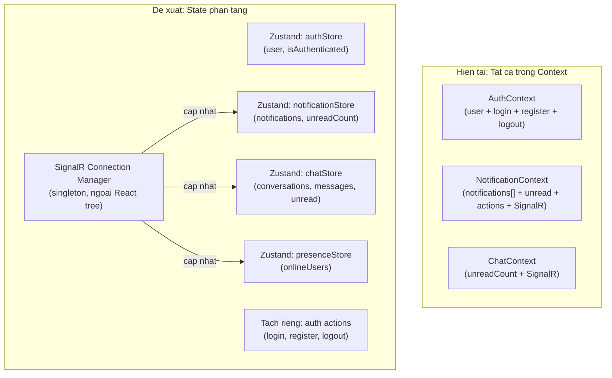
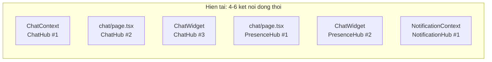
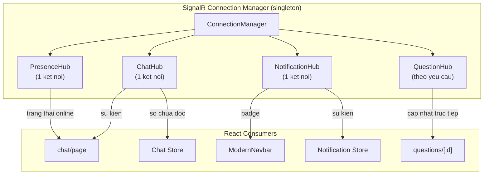

# Danh Gia Kien Truc Frontend -- SocialTechsy Social Network

## Tong Quan Cong Nghe Hien Tai

- Next.js 16.1.2 (App Router) voi React Compiler bat
- React 19.2.3 + React DOM 19.2.3
- Tailwind CSS v4 (cau hinh bang CSS)
- SignalR 10.0.0 (WebSockets, 5 hubs)
- Axios 1.13.2 (cung dung `fetch` thu cong khong nhat quan)
- Khong co thu vien data-fetching (khong TanStack Query, khong SWR)
- Khong co thu vien state management ben ngoai (chi dung Context API)
- 34 routes, 55+ components `"use client"`, 0 Server Components

---

## PHAN 1 -- Danh Gia Kha Nang Mo Rong Kien Truc

### 1.1 Nhung diem lam tot

- **React Compiler** duoc bat qua `babel-plugin-react-compiler` -- tu dong memoize renders, giam bot anh huong khi thieu `React.memo`/`useMemo` thu cong
- **App Router** co cau truc sach, nhom logic hop ly (`/questions`, `/repositories`, `/chat`, `/groups`)
- **SignalR hook** (`useSignalR`) cung cap factory ket noi tai su dung voi auto reconnect
- **Tailwind v4** voi CSS variables va `@custom-variant dark` ho tro theming sach se

### 1.2 Cac van de cau truc han che kha nang mo rong


| Van de                                                           | Anh huong                                                                                    | Muc do       |
| ---------------------------------------------------------------- | -------------------------------------------------------------------------------------------- | ------------ |
| Tat ca trang deu la `"use client"` -- khong co Server Components | Khong SSR, khong streaming, khong SEO, moi trang gui toan bo JS bundle xuong client          | Nghiem trong |
| Chi co 1 root layout, khong co nested layouts                    | Khong the chia se state/UI theo nhom route (vd: auth vs app vs chat)                         | Cao          |
| Khong co route groups `(auth)`, `(app)`, `(chat)`                | Khong the ap dung layouts, loading states, hay middleware khac nhau cho tung phan            | Cao          |
| Khong co `loading.tsx` / `error.tsx` / `not-found.tsx`           | Khong co skeleton loading, khong phuc hoi loi, khong xu ly 404                               | Cao          |
| Khong co `middleware.ts` de bao ve route                         | Kiem tra xac thuc o client sau khi render toan bo trang -- nhap nhay noi dung chua dang nhap | Cao          |
| Route trung lap: `/tag-preferences` va `/tags/preferences`       | Gay nham lan, pha loang SEO                                                                  | Thap         |
| `/login` va `/register` chi la trang redirect                    | Nen xu ly bang `middleware.ts` rewrites hoac route groups                                    | Thap         |


---

## PHAN 2 -- Cac Van De Hieu Nang Da Phat Hien

### 2.1 Van de cay component

**P0: Trang chat la 1,379 dong trong mot component duy nhat** (`[frontend/src/app/chat/page.tsx](frontend/src/app/chat/page.tsx)`)

```
ChatContent (1 component)
├── ~20 khai bao useState
├── Ket noi SignalR ChatHub (trung lap voi ChatContext)
├── Ket noi SignalR PresenceHub
├── Render danh sach hoi thoai
├── Render danh sach tin nhan (khong co virtualization)
├── Reaction picker
├── Media picker + upload
├── Lightbox
├── Modal tao hoi thoai moi
└── Chi bao dang nhap
```

Moi thay doi state o bat ky phan nao deu re-render toan bo cay 1,379 dong. Day la diem nghen hieu nang lon nhat.

**P1: Khong co virtualization cho danh sach nao**

- Danh sach thong bao, hoi thoai, tin nhan, nguoi dung, cau hoi -- tat ca deu render moi item vao DOM
- Nguoi dung co 500+ tin nhan hoac 100+ hoi thoai se bi giat lag

**P2: Code mo coi va code chet**

- `[ChatWidget.tsx](frontend/src/components/ChatWidget.tsx)` (747 dong) -- khong duoc render o dau ca
- `useVote`, `useChat`, `useNotifications` (tu `useSignalR.ts`), `useToast` -- tat ca khong su dung
- 18 file JS cu trong `public/js/` -- di san tu kien truc server-rendered, khong duoc load

### 2.2 Cac diem nong re-render

**AuthContext re-render 25+ consumers moi khi state thay doi:**

```5:14:frontend/src/lib/contexts/AuthContext.tsx
// login, register, logout duoc tao lai moi lan render
// vi chung la ham thuong duoc dinh nghia trong than component.
// Moi consumer cua useAuth() deu re-render khi BAT KY ham nao thay doi.
value={{
    user,
    isAuthenticated: !!user,
    isLoading,
    login,    // tham chieu moi moi render
    register, // tham chieu moi moi render
    logout,   // tham chieu moi moi render
}}
```

Du React Compiler co the tu dong memoize nhung khong dam bao tham chieu on dinh cho cac ham async dong trên `setUser`. Day la "bom hen gio" khi ung dung phat trien.

**NotificationContext day cap nhat real-time thuong xuyen den tat ca consumers:**

- Moi su kien `ReceiveNotification` den deu trigger `setState` tren mang notification
- Tat ca 5 consumers (Navbar, Sidebar, Header, v.v.) deu re-render moi khi co thong bao

### 2.3 Lo ngai ve kich thuoc bundle

- Tat ca 34 trang deu la client components -- toan bo JS cua trang duoc gui khi tai trang
- Khong co `React.lazy()` hay `next/dynamic` cho cac component nang (MarkdownContent, ReactionPicker, code syntax highlighter)
- `react-syntax-highlighter` bao gom tat ca ngon ngu mac dinh -- day la dependency 200KB+

---

## PHAN 3 -- De Xuat Cai Tien

### 3.1 Quan Ly State

**Hien trang:** 3 contexts (Auth, Chat, Notification) boc toan bo ung dung. Khong co thu vien ben ngoai.

**Van de:** Context API khong duoc thiet ke cho cap nhat tan suat cao. Moi thay doi state trong context deu re-render tat ca consumers, bat ke ho dung slice nao.

**Kien truc de xuat (theo mo hinh Discord):**




Thay doi chinh:

- **Thay contexts bang Zustand stores** -- subscribers chi re-render khi slice ho chon thay doi (`useStore(s => s.unreadCount)`)
- **Tach quan ly ket noi SignalR ra ngoai React** -- cac ket noi nen la singletons do class quan ly, khong tao trong `useEffect` hooks
- **Tach du lieu auth khoi hanh dong auth** -- 25+ components can `user`, nhung chi 2 can `login`/`register`

### 3.2 Xu Ly API

**Hien trang:** Goi Axios truc tiep trong `useEffect` tren 35+ file. Mot so trang dung `fetch` thu cong.

**Loi nghiem trong: 4 trang bo qua Axios interceptor va khong co refresh token:**

- `[frontend/src/app/newsfeed/page.tsx](frontend/src/app/newsfeed/page.tsx)` -- dung `fetch()`
- `[frontend/src/app/friends/page.tsx](frontend/src/app/friends/page.tsx)` -- dung `fetch()`
- `[frontend/src/app/groups/page.tsx](frontend/src/app/groups/page.tsx)` -- dung `fetch()`
- `[frontend/src/lib/contexts/NotificationContext.tsx](frontend/src/lib/contexts/NotificationContext.tsx)` -- dung `fetch()`

Khi access token het han tren cac trang nay, nguoi dung gap loi am tham khong co co che refresh.

**Kien truc de xuat (theo mo hinh GitHub):**

1. **Ap dung TanStack Query v5** lam tang data-fetching:
  - Tu dong caching, chong trung, refetch ngam
  - `staleTime` / `gcTime` de kiem soat cache
  - `useInfiniteQuery` cho feed phan trang (questions, notifications, newsfeed)
  - Optimistic updates cho votes, reactions, follows
2. **Tao cac API service module co kieu** -- moi module cho mot domain:

```
lib/api/
├── client.ts          (Axios instance hien co)
├── auth.api.ts        (login, register, logout, refresh, me)
├── questions.api.ts   (CRUD, search, tags)
├── chat.api.ts        (conversations, messages, media)
├── notifications.api.ts
├── users.api.ts       (profile, follow, preferences)
├── repositories.api.ts
├── groups.api.ts
├── newsfeed.api.ts
└── search.api.ts
```

1. **Loai bo tat ca lenh `fetch()` thu cong** -- chuyen tat ca qua `apiClient` de dam bao token refresh hoat dong
2. **Chuyen JWT tokens tu `localStorage` sang `httpOnly` cookies** -- cach dung `localStorage` hien tai de bi tan cong XSS. Day la cach Reddit va GitHub xu ly tokens.

### 3.3 Ket Noi Realtime (SignalR)

**Hien trang:** Nhieu ket noi SignalR doc lap bi trung lap.

**Ban do trung lap ket noi:**




Tren trang `/chat`, nguoi dung co **3 ket noi ChatHub** va **2 ket noi PresenceHub** chay dong thoi. Moi ket noi WebSocket tieu ton tai nguyen server va co the gay race conditions voi thu tu tin nhan.

**Kien truc de xuat (theo mo hinh Connection Manager cua Discord):**




Thay doi chinh:

- **Singleton connection manager** ngoai React tree -- tao ket noi mot lan, chia se cho tat ca consumers
- **Event bus pattern** -- components dang ky su kien cu the, khong phai toan bo ket noi
- **Ket noi theo yeu cau** -- QuestionHub chi ket noi khi xem cau hoi, ngat khi roi di
- **Refresh token trong SignalR** -- hien tai `accessTokenFactory` bat token tai thoi diem tao ket noi va khong bao gio cap nhat. Sau khi refresh token, ket noi lai SignalR se that bai.

### 3.4 Loi xu ly token trong SignalR

```29:29:frontend/src/lib/hooks/useSignalR.ts
const token = typeof window !== 'undefined' ? localStorage.getItem('accessToken') : null;
```

Dong nay bat token mot lan khi tao ket noi. `accessTokenFactory` nen doc tu localStorage moi lan goi:

```typescript
accessTokenFactory: () => localStorage.getItem('accessToken') || '',
```

Neu khong, sau khi refresh token, moi lan SignalR thu ket noi lai se dung token cu (da het han) va that bai.

---

## PHAN 4 -- De Xuat Cap Production

### 4.1 Server Components va SSR (nhu Reddit, GitHub)


| Thay doi                                                                                                     | Ly do                                                                    |
| ------------------------------------------------------------------------------------------------------------ | ------------------------------------------------------------------------ |
| Chuyen cac trang chi doc sang Server Components: `/questions`, `/tags`, `/users`, `/repositories`, `/search` | Loai bo client JS cho hien thi du lieu, bat streaming SSR, cai thien SEO |
| Dung Server Actions cho mutations (vote, follow, save)                                                       | Giam client bundle, ho tro progressive enhancement                       |
| Them `loading.tsx` skeletons cho moi route segment                                                           | Hieu nang cam nhan tuc thi voi Suspense boundaries                       |
| Them `error.tsx` boundaries cho moi route group                                                              | Phuc hoi loi mượt ma, khong crash toan trang                             |
| Them `not-found.tsx` cho dynamic routes                                                                      | Xu ly 404 dung cach cho `/questions/[id]`, `/users/[id]`, v.v.           |


### 4.2 Kien truc route (nhu GitHub)

```
app/
├── (auth)/                    # Layout auth: khong sidebar, can giua
│   ├── layout.tsx
│   ├── auth/page.tsx
│   ├── forgot-password/page.tsx
│   └── reset-password/page.tsx
├── (app)/                     # Layout chinh: sidebar + navbar
│   ├── layout.tsx             # AppLayout voi sidebar dung chung
│   ├── page.tsx               # Trang chu/dashboard
│   ├── questions/
│   ├── repositories/
│   ├── users/
│   ├── tags/
│   ├── search/
│   ├── saved/
│   ├── settings/
│   ├── notifications/
│   ├── newsfeed/
│   ├── friends/
│   └── groups/
├── (chat)/                    # Layout chat: giao dien toi gian
│   ├── layout.tsx             # Layout rieng cho chat
│   └── chat/page.tsx
└── middleware.ts               # Bao ve route
```

### 4.3 Phan tach trang chat (nhu Discord)

Tach component khong lo 1,379 dong thanh cac component tap trung:

```
components/chat/
├── ConversationList.tsx        # Danh sach hoi thoai co virtualization + tim kiem
├── ConversationItem.tsx        # Mot hang hoi thoai (React.memo)
├── MessageList.tsx             # Danh sach tin nhan co virtualization
├── MessageBubble.tsx           # Mot tin nhan (React.memo)
├── MessageInput.tsx            # Input + media + reply
├── MessageReactions.tsx        # Hien thi reaction + picker
├── TypingIndicator.tsx         # Dau cham dang nhap
├── OnlineStatus.tsx            # Chi bao trang thai online
├── NewConversationModal.tsx    # Tim kiem nguoi dung + tao hoi thoai
└── hooks/
    ├── useChatMessages.ts      # TanStack Query cho tin nhan
    ├── useChatSignalR.ts       # Dang ky su kien SignalR
    └── usePresence.ts          # Quan ly trang thai online
```

### 4.4 Middleware bao ve route

```typescript
// middleware.ts
import { NextRequest, NextResponse } from 'next/server';

const publicRoutes = ['/auth', '/login', '/register', '/forgot-password', '/reset-password'];

export function middleware(request: NextRequest) {
  const token = request.cookies.get('accessToken');
  const { pathname } = request.nextUrl;
  
  if (!token && !publicRoutes.some(r => pathname.startsWith(r))) {
    return NextResponse.redirect(new URL('/auth', request.url));
  }
  
  if (token && publicRoutes.some(r => pathname.startsWith(r))) {
    return NextResponse.redirect(new URL('/', request.url));
  }
}
```

### 4.5 Toi uu hieu nang


| Toi uu                                 | Cach thuc hien                                                       |
| -------------------------------------- | -------------------------------------------------------------------- |
| **Virtualize tat ca danh sach**        | `react-virtuoso` cho tin nhan, thong bao, nguoi dung, cau hoi        |
| **Dynamic imports** cho component nang | `next/dynamic` cho MarkdownContent, ReactionPicker, code highlighter |
| **Toi uu hinh anh**                    | Dung `next/image` voi blur placeholders cho avatar va media          |
| **Prefetching**                        | `<Link prefetch>` cho cac duong di thuong dung                       |
| **Phan tich bundle**                   | Them `@next/bundle-analyzer` de nhan dien va tree-shake imports nang |


### 4.6 Xoa code chet


| Muc                                                                                                                          | Hanh dong                                                                                      |
| ---------------------------------------------------------------------------------------------------------------------------- | ---------------------------------------------------------------------------------------------- |
| `[frontend/src/components/ChatWidget.tsx](frontend/src/components/ChatWidget.tsx)` (747 dong)                                | Xoa -- component mo coi, khong duoc import o dau                                               |
| `[frontend/src/lib/hooks/useToast.tsx](frontend/src/lib/hooks/useToast.tsx)`                                                 | Xoa -- ung dung dung `react-hot-toast` thay the                                                |
| `useVote`, `useChat`, `useNotifications`, `useQuestionUpdates` trong `[useSignalR.ts](frontend/src/lib/hooks/useSignalR.ts)` | Xoa cac export khong dung (dong 103-275), giu lai chi `useSignalR`                             |
| 18 file trong `[frontend/public/js/](frontend/public/js/)`                                                                   | Xoa -- script cu tu kien truc server-rendered, khong con duoc load                             |
| Khoi tao AOS trong `[Providers.tsx](frontend/src/lib/contexts/Providers.tsx)`                                                | Xoa -- AOS khong duoc cai dat trong dependencies; `@ts-expect-error` xac nhan day la code chet |


---

## Thu Tu Trien Khai Uu Tien

### Giai doan 1 -- Sua loi nghiem trong va xoa code chet

1. Sua SignalR `accessTokenFactory` de doc token dong
2. Thay tat ca `fetch()` thu cong bang `apiClient` (4 file)
3. Xoa code chet (ChatWidget, hooks khong dung, legacy JS, AOS)
4. Them `middleware.ts` de bao ve route

### Giai doan 2 -- Hien dai hoa tang du lieu

1. Cai TanStack Query, tao cac API service modules
2. Chuyen cac trang tu `useEffect` fetching sang `useQuery`/`useMutation`
3. Them `loading.tsx` va `error.tsx` boundaries

### Giai doan 3 -- Kien truc state va realtime

1. Cai Zustand, chuyen contexts sang stores
2. Xay dung singleton SignalR connection manager
3. Loai bo cac ket noi hub trung lap

### Giai doan 4 -- Hieu nang va SSR

1. Phan tach trang chat thanh cac component tap trung
2. Them virtualization cho danh sach (`react-virtuoso`)
3. Trien khai route groups voi nested layouts
4. Chuyen cac trang chi doc sang Server Components
5. Them dynamic imports cho cac component nang

