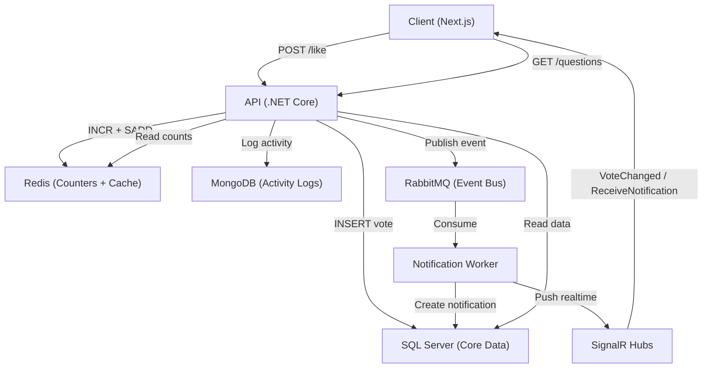

# Redesign Like and View System

## Current State Analysis

The project already has all infrastructure configured and running:

- **Redis**: connected via `StackExchange.Redis`, used for chat cache, presence, SignalR backplane
- **MongoDB**: connected via `MongoDB.Driver`, used for chat messages
- **RabbitMQ**: connected via `RabbitMQ.Client`, used for chat message events
- **SignalR**: 6 hubs exist (`ChatHub`, `NotificationHub`, `QuestionHub`, `ActivityHub`, `PresenceHub`, `CallHub`)
- **SQL Server**: core data (Questions, Votes, Notifications, Users)

### Current Problems

1. **Votes**: stored in SQL `Votes` table, score computed by `SELECT + SUM` every time (N+1 queries on list pages)
2. **Views**: direct SQL `UPDATE SET ViewCount = ViewCount + 1` on every page load -- heavy write load
3. **Like notification**: only saves to SQL `Notifications` table, no realtime push via SignalR
4. **No activity logging**: no MongoDB activity logs for likes/views

---

## Phase 1: Redis Like Counter + Cache

### 1.1 Create `RedisLikeService`

New file: [backend/src/SocialTechsy.SocialNetwork.Infrastructure/Redis/RedisLikeService.cs](backend/src/SocialTechsy.SocialNetwork.Infrastructure/Redis/RedisLikeService.cs)

Redis key design:

- `like:question:{id}:count` -- like count (INCR/DECR)
- `like:question:{id}:users` -- SET of userIds who liked (SADD/SREM/SISMEMBER)
- `like:answer:{id}:count` -- like count
- `like:answer:{id}:users` -- SET of userIds who liked

Methods:

```csharp
Task<bool> IsLikedAsync(string targetType, int targetId, int userId);
Task<long> LikeAsync(string targetType, int targetId, int userId);
Task<long> UnlikeAsync(string targetType, int targetId, int userId);
Task<long> GetLikeCountAsync(string targetType, int targetId);
Task<Dictionary<int, long>> GetLikeCountsAsync(string targetType, int[] targetIds);
```

### 1.2 Update `VoteQuestionCommandHandler` and `VoteAnswerCommandHandler`

Modify [VoteCommandHandlers.cs](backend/src/SocialTechsy.SocialNetwork.Application/CommandHandlers/Votes/VoteCommandHandlers.cs):

- After SQL write, update Redis counter via `RedisLikeService`
- On like: `SADD` user to set + `INCR` count
- On unlike: `SREM` user from set + `DECR` count

### 1.3 Update Query Handlers to read from Redis

Modify score computation in:

- [GetQuestionsQueryHandler.cs](backend/src/SocialTechsy.SocialNetwork.Application/QueryHandlers/Questions/GetQuestionsQueryHandler.cs) -- batch get counts from Redis instead of per-item SQL
- [GetQuestionByIdQueryHandler.cs](backend/src/SocialTechsy.SocialNetwork.Application/QueryHandlers/Questions/GetQuestionByIdQueryHandler.cs)
- [AnswerQueryHandlers.cs](backend/src/SocialTechsy.SocialNetwork.Application/QueryHandlers/Answers/AnswerQueryHandlers.cs)
- [UserContentQueryHandlers.cs](backend/src/SocialTechsy.SocialNetwork.Application/QueryHandlers/Users/UserContentQueryHandlers.cs)

Fallback to SQL if Redis is unavailable.

---

## Phase 2: Redis View Counter + Batch Sync

### 2.1 Create `RedisViewService`

New file: [backend/src/SocialTechsy.SocialNetwork.Infrastructure/Redis/RedisViewService.cs](backend/src/SocialTechsy.SocialNetwork.Infrastructure/Redis/RedisViewService.cs)

Redis key design:

- `view:question:{id}` -- view count (INCR)
- `view:question:{id}:visitors` -- HyperLogLog for unique view tracking

Methods:

```csharp
Task<long> IncrementViewAsync(int questionId, string? userId, string? ip);
Task<long> GetViewCountAsync(int questionId);
Task<Dictionary<int, long>> GetViewCountsAsync(int[] questionIds);
```

### 2.2 Create `ViewSyncBackgroundService`

New file: [backend/src/SocialTechsy.SocialNetwork.Infrastructure/Redis/ViewSyncBackgroundService.cs](backend/src/SocialTechsy.SocialNetwork.Infrastructure/Redis/ViewSyncBackgroundService.cs)

- `IHostedService` that runs every 60 seconds
- Reads all `view:question:*` keys from Redis
- Batch updates SQL Server `Questions.ViewCount`
- Resets Redis counters after sync (using atomic GETSET)

### 2.3 Update View Endpoint

Modify [QuestionsController.cs](backend/src/SocialTechsy.SocialNetwork.Api/Controllers/QuestionsController.cs):

- `GET /api/questions/{id}` increments Redis view counter instead of SQL
- Fire-and-forget, no need for MediatR command

---

## Phase 3: MongoDB Activity Logs

### 3.1 Create MongoDB Collections

New file: [backend/src/SocialTechsy.SocialNetwork.Infrastructure/MongoDB/ActivityLogService.cs](backend/src/SocialTechsy.SocialNetwork.Infrastructure/MongoDB/ActivityLogService.cs)

Collections:

- `post_likes` -- `{ postId, userId, targetType, createdAt }`
- `post_views` -- `{ postId, userId, ip, userAgent, createdAt }`

Indexes:

- `post_likes`: compound unique index on `(targetType, postId, userId)`
- `post_views`: index on `(postId, createdAt)`

### 3.2 Log activities from command handlers

After Redis operations in VoteCommandHandlers, also insert into MongoDB activity log (fire-and-forget, non-blocking).

---

## Phase 4: RabbitMQ Event Bus for Notifications

### 4.1 Create Generic Event Publisher

New file: [backend/src/SocialTechsy.SocialNetwork.Infrastructure/RabbitMQ/EventPublisher.cs](backend/src/SocialTechsy.SocialNetwork.Infrastructure/RabbitMQ/EventPublisher.cs)

Extend existing RabbitMQ setup (already has `RabbitMqChatMessageBroker`) with a new exchange:

- Exchange: `social.events` (topic)
- Routing keys: `like.question`, `like.answer`, `view.question`

### 4.2 Create Notification Consumer Worker

New file: [backend/src/SocialTechsy.SocialNetwork.Infrastructure/RabbitMQ/LikeNotificationConsumer.cs](backend/src/SocialTechsy.SocialNetwork.Infrastructure/RabbitMQ/LikeNotificationConsumer.cs)

- `IHostedService` that consumes from `social.events` queue
- On `like.*` event: create Notification in SQL + push via SignalR

### 4.3 Decouple notification creation

Remove direct notification creation from `VoteNotificationHandler`. Instead, publish to RabbitMQ. The consumer worker handles:

1. Insert Notification to SQL
2. Push realtime via SignalR NotificationHub

---

## Phase 5: SignalR Realtime Push

### 5.1 Push like count updates via QuestionHub

After a like/unlike, broadcast to the question room via existing [QuestionHub.cs](backend/src/SocialTechsy.SocialNetwork.Api/Hubs/QuestionHub.cs) `VoteChanged` event:

```csharp
await _questionHub.Clients.Group($"question_{questionId}")
    .SendAsync("VoteChanged", new { questionId, answerId, likeCount, likedByUserId });
```

### 5.2 Push notifications via NotificationHub

From the RabbitMQ consumer worker:

```csharp
await _notificationHub.Clients.Group($"user_{targetUserId}")
    .SendAsync("ReceiveNotification", notification);
```

### 5.3 Frontend: Subscribe to realtime updates

Update [questions/[id]/page.tsx](frontend/src/app/(app)/questions/[id]/page.tsx):

- Connect to `QuestionHub` via `useHub('question')`
- On `VoteChanged` event: update React Query cache with new like count
- On mount: `invoke('JoinQuestion', questionId)`, on unmount: `invoke('LeaveQuestion', questionId)`

---

## Phase 6: Frontend API Cleanup

### 6.1 Simplify vote API

Update [votes.api.ts](frontend/src/lib/api/votes.api.ts):

- `POST /api/posts/{id}/like` -> toggle like
- `DELETE /api/posts/{id}/like` -> unlike
- Response includes `{ liked: boolean, likeCount: number }`

### 6.2 Update question detail page

Update [questions/[id]/page.tsx](frontend/src/app/(app)/questions/[id]/page.tsx):

- Listen to `VoteChanged` SignalR event for realtime like count sync across tabs/users
- Optimistic UI remains for instant feedback

---

## Architecture Flow Diagram




## File Changes Summary

- **New files (5)**: `RedisLikeService.cs`, `RedisViewService.cs`, `ViewSyncBackgroundService.cs`, `ActivityLogService.cs`, `EventPublisher.cs` / `LikeNotificationConsumer.cs`
- **Modified backend (6)**: `VoteCommandHandlers.cs`, `GetQuestionsQueryHandler.cs`, `GetQuestionByIdQueryHandler.cs`, `AnswerQueryHandlers.cs`, `QuestionsController.cs`, `DependencyInjection.cs`
- **Modified frontend (3)**: `votes.api.ts`, `questions/[id]/page.tsx`, `connectionManager.ts` (type update)

