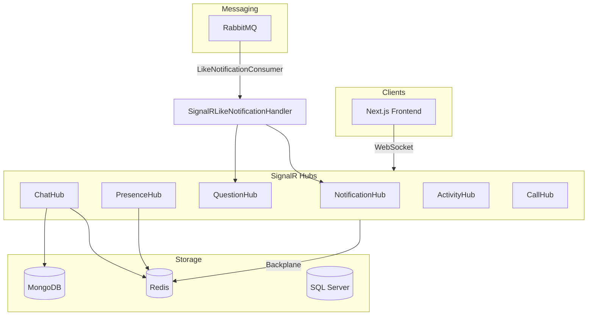
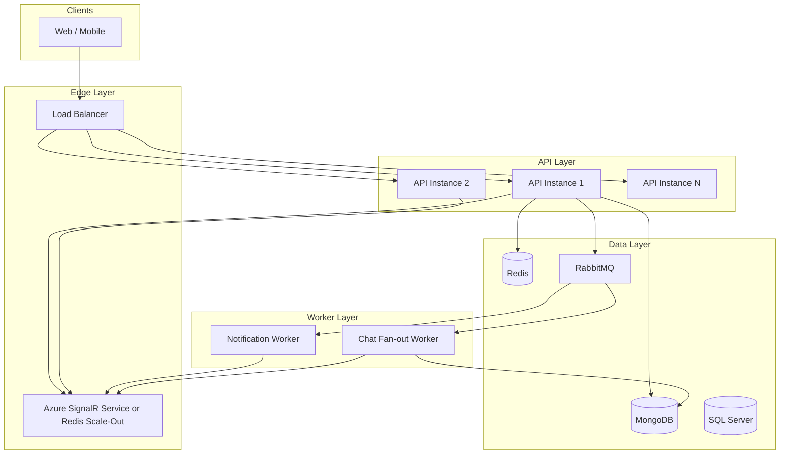

# Realtime Architecture Evaluation and Improvement Plan

## 1. Current Architecture Summary




### 1.1 SignalR Hubs (6 total)


| Hub             | Endpoint              | Purpose                                     | Notes                                                 |
| --------------- | --------------------- | ------------------------------------------- | ----------------------------------------------------- |
| ChatHub         | `/hubs/chat`          | Messaging, typing, reactions, read receipts | Uses MediatR, rate-limited, group `conversation_{id}` |
| NotificationHub | `/hubs/notifications` | Push notifications to user                  | Group `user_{id}`                                     |
| QuestionHub     | `/hubs/question`      | Vote, answer, comment updates               | Group `question_{id}`                                 |
| PresenceHub     | `/hubs/presence`      | Online/offline status                       | Redis-backed, `Clients.Others` broadcast              |
| ActivityHub     | `/hubs/activity`      | Newsfeed, group posts                       | Groups `activity_feed`, `group_{id}`                  |
| CallHub         | `/hubs/call`          | WebRTC signaling                            | Basic hub                                             |


### 1.2 Chat Storage (MongoDB)

- **Collections**: `conversations`, `messages`, `counters`
- **Indexes**: `(ConversationId, SentDate)`, `(ConversationId, IsRead, SenderId)`
- **Features**: Delta sync via `GetMessagesSinceAsync(conversationId, sinceMessageId, limit=200)`

### 1.3 Redis Usage

- **SignalR backplane** (when `Redis:Enabled`) – multi-instance scaling
- **RedisChatCacheService**: sequences, conversation cache (10m TTL), user info (5m TTL), unread counts
- **RedisPresenceService**: `presence:user:{userId}` (Set of connectionIds), `presence:online` tracking set
- **RedisChatRateLimiter**: Sliding window (30 msg/min per user)
- **L1+L2 CacheService**: Distributed cache for queries

---

## 2. Bottleneck Analysis

### 2.1 PresenceHub – Broadcast Storm

**File**: [backend/src/SocialTechsy.SocialNetwork.Api/Hubs/PresenceHub.cs](backend/src/SocialTechsy.SocialNetwork.Api/Hubs/PresenceHub.cs)

```csharp
await Clients.Others.SendAsync("UserOnline", userId);  // Line 30, 36
await Clients.Others.SendAsync("UserOffline", userId); // Line 54, 60
```

- Broadcasts to **all** connected clients, not only friends/relevant users.
- At scale (e.g. 100k+ concurrent users), every connect/disconnect triggers a broadcast to everyone.
- **Messenger/Slack**: Presence is scoped to friends/workspace members only.

### 2.2 ActivityHub – Single Global Group

**File**: [backend/src/SocialTechsy.SocialNetwork.Api/Hubs/ActivityHub.cs](backend/src/SocialTechsy.SocialNetwork.Api/Hubs/ActivityHub.cs)

- All connected users join `activity_feed`.
- `NewPost` / `NewGroupPost` sent to `activity_feed` = broadcast to all users.
- No frontend `useHub('activity')` in [connectionManager.ts](frontend/src/lib/signalr/connectionManager.ts) – `HubName` lacks `'activity'`.

### 2.3 Offline Message Handling – Partial


| Component                     | Behavior                                                                 |
| ----------------------------- | ------------------------------------------------------------------------ |
| ChatHub.BroadcastMessageAsync | Sends `NewMessageNotification` to `user_{uid}` only if user is connected |
| ChatMessageConsumerService    | Creates SQL `Notification` for chat messages via RabbitMQ                |
| SyncMessages                  | Client calls on reconnect with `lastMessageId` → delta from MongoDB      |


- Realtime push for chat is **online-only**; offline users get a DB notification.
- No server-side "pending push" queue for when user comes back online.
- SyncMessages covers message history; reconnect does not trigger a "you have N offline messages" SignalR event.

### 2.4 Chat Write Path – Synchronous Broadcast

- `SendMessageCommand` → MongoDB write → ChatHub `BroadcastMessageAsync` in the same request.
- If SignalR send fails (e.g. recipient on another instance, backplane delay), message is still stored but realtime delivery may be missed.
- No retry or at-least-once guarantee for SignalR delivery.

### 2.5 Connection Manager – No Activity Hub

**File**: [frontend/src/lib/signalr/connectionManager.ts](frontend/src/lib/signalr/connectionManager.ts)

```typescript
type HubName = 'chat' | 'notifications' | 'presence' | 'question' | 'call';
```

- `'activity'` missing; ActivityHub is not used by the shared connection manager.

### 2.6 Presence – GetOnlineUsers O(N)

**File**: [backend/src/SocialTechsy.SocialNetwork.Infrastructure/Redis/RedisPresenceService.cs](backend/src/SocialTechsy.SocialNetwork.Infrastructure/Redis/RedisPresenceService.cs)

- `GetOnlineUserIdsAsync()` returns all online user IDs.
- Chat page calls this for every user in conversations; at scale this is heavy.
- Should be scoped to "friends" or "conversation participants" with per-user caching.

---

## 3. Improvement Recommendations

### 3.1 Message Delivery


| Improvement            | Description                                                                                             |
| ---------------------- | ------------------------------------------------------------------------------------------------------- |
| At-least-once delivery | Publish message to RabbitMQ after MongoDB write; consumer pushes via SignalR. If push fails, retry/DLQ. |
| Idempotent receivers   | Client deduplicates by `messageId` (already supported by React state logic).                            |
| Delivery receipts      | `AcknowledgeDelivery` exists; ensure frontend sends `delivered`/`read` on receipt.                      |
| Parallel fan-out       | Use `Task.WhenAll` for multi-recipient sends (already done in `BroadcastMessageAsync`).                 |


### 3.2 Offline Message Handling


| Improvement                    | Description                                                                                                                       |
| ------------------------------ | --------------------------------------------------------------------------------------------------------------------------------- |
| Reconnect sync trigger         | On `onreconnected`, client calls `SyncMessages` for each open conversation with `lastMessageId`.                                  |
| Offline notification push      | `ChatMessageConsumerService` should call SignalR when user reconnects – requires "pending notifications" queue per user in Redis. |
| Optional: Redis per-user queue | Store `user:{userId}:pending_push` (list of message IDs) when user offline; on reconnect, consumer drains and pushes.             |


### 3.3 Scaling SignalR


| Current                     | Recommendation                                                                       |
| --------------------------- | ------------------------------------------------------------------------------------ |
| Redis backplane (in-memory) | Keep for multi-instance; consider **Azure SignalR Service** for 10k+ concurrent.     |
| Single process affinity     | No sticky sessions; Redis backplane handles cross-instance.                          |
| Connection limits           | Use `MaxReceiveMessageSize`, `ApplicationMaximumTransferUnit` to limit payload size. |
| Hub separation              | Already split (Chat, Notification, Question, etc.); good for horizontal scaling.     |


---

## 4. Production Architecture (Messenger/Slack-style)




### 4.1 Architectural Changes


| Layer     | Current                        | Target                                                                                                 |
| --------- | ------------------------------ | ------------------------------------------------------------------------------------------------------ |
| Realtime  | SignalR + Redis backplane      | Option A: Keep Redis backplane (up to ~10k). Option B: Azure SignalR Service (10k+).                   |
| Presence  | Broadcast to all               | Scoped: friends list / workspace members. `Clients.Group("friends_of_{userId}")` or per-friend groups. |
| Activity  | Global `activity_feed`         | Sharded: `activity_feed:{userId}` or `activity_feed:friends_{userId}`.                                 |
| Chat push | Inline in ChatHub              | Move to RabbitMQ consumer (like LikeNotificationConsumer) for retry, DLQ, scaling.                     |
| Offline   | DB notification + SyncMessages | Add Redis `pending_push:{userId}`; drain on reconnect.                                                 |


### 4.2 Scoped Presence (Friends-based)

```
User A connects → Join groups: user_A, friends_A (contains friend user IDs)
User B (friend) goes online → Notify only Clients.Group("friends_B") 
→ Only B's friends receive UserOnline(B)
```

- Requires `friends_of_{userId}` or similar group populated from friendship graph.
- `GetOnlineUsers` replaced by `GetOnlineFriends` or `GetOnlineInConversation(conversationId)`.

### 4.3 Sharded Activity Feed

- Each user joins `activity_feed:user_{userId}` (personalized) or `activity_feed:friends_{userId}`.
- Server sends only to relevant groups when new post/question is created.
- Reduces broadcast size from N users to ~friends count.

### 4.4 Chat Push via RabbitMQ

```
SendMessageCommand → MongoDB → Publish ChatPushEvent to RabbitMQ
→ ChatPushConsumer: for each recipient, if online → SignalR push; else → Redis pending_push
→ On reconnect: check pending_push, drain and push
```

---

## 5. Implementation Priority


| Priority | Task                                                                        | Effort | Impact                        |
| -------- | --------------------------------------------------------------------------- | ------ | ----------------------------- |
| P1       | Add `activity` to HubName and connect ActivityHub on newsfeed               | Low    | Fix missing realtime activity |
| P1       | Scope PresenceHub to friends (avoid `Clients.Others`)                       | Medium | Eliminate broadcast storm     |
| P2       | Move chat push to RabbitMQ consumer (like LikeNotificationConsumer)         | Medium | Retry, DLQ, scaling           |
| P2       | Reconnect sync: call SyncMessages on `onreconnected` for open conversations | Low    | Better offline recovery       |
| P3       | Redis pending_push for offline users; drain on reconnect                    | Medium | Messenger-style offline       |
| P3       | Replace GetOnlineUsers with GetOnlineInConversation / GetOnlineFriends      | Low    | Reduce load                   |


---

## 6. Key Files Reference


| Area             | Files                                                                                                                                                                                              |
| ---------------- | -------------------------------------------------------------------------------------------------------------------------------------------------------------------------------------------------- |
| SignalR config   | [Program.cs](backend/src/SocialTechsy.SocialNetwork.Api/Program.cs) L190-206                                                                                                                       |
| Chat storage     | [MongoChatRepository.cs](backend/src/SocialTechsy.SocialNetwork.Infrastructure/MongoDB/MongoChatRepository.cs)                                                                                     |
| Redis chat cache | [RedisChatCacheService.cs](backend/src/SocialTechsy.SocialNetwork.Infrastructure/Redis/RedisChatCacheService.cs)                                                                                   |
| Presence         | [RedisPresenceService.cs](backend/src/SocialTechsy.SocialNetwork.Infrastructure/Redis/RedisPresenceService.cs), [PresenceHub.cs](backend/src/SocialTechsy.SocialNetwork.Api/Hubs/PresenceHub.cs)   |
| Chat flow        | [ChatHub.cs](backend/src/SocialTechsy.SocialNetwork.Api/Hubs/ChatHub.cs), [ChatCommandHandlers.cs](backend/src/SocialTechsy.SocialNetwork.Application/CommandHandlers/Chat/ChatCommandHandlers.cs) |
| Frontend SignalR | [connectionManager.ts](frontend/src/lib/signalr/connectionManager.ts), [useHub.ts](frontend/src/lib/signalr/useHub.ts)                                                                             |


