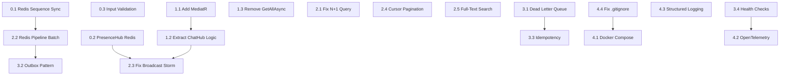

# SocialTechsy System Upgrade Plan

## Current State: 5.25/10 Production Readiness

## Target State: 8+/10 Production Readiness

---

## Phase 0 - Critical Fixes (Must-do, breaks at any scale)

These are bugs that will cause **data corruption or system failure** even at small scale.

### 0.1 Fix Redis Sequence Sync on Startup

**Problem**: When Redis restarts, `INCR` starts from 0, causing duplicate MessageId/ConversationId and data corruption.

**File**: [backend/src/SocialTechsy.SocialNetwork.Infrastructure/Redis/RedisChatCacheService.cs](backend/src/SocialTechsy.SocialNetwork.Infrastructure/Redis/RedisChatCacheService.cs)

**Fix**: Add a startup sync method and call it from DI registration:

```csharp
public async Task EnsureSequenceSyncedAsync(IMongoCollection<CounterDocument> counters)
{
    var allCounters = await counters.Find(_ => true).ToListAsync();
    foreach (var counter in allCounters)
    {
        await SyncSequenceAsync(counter.Id, counter.SequenceValue);
    }
}
```

Call from [DependencyInjection.cs](backend/src/SocialTechsy.SocialNetwork.Infrastructure/DependencyInjection.cs) after Redis + MongoDB are both registered.

### 0.2 Fix PresenceHub Static Dictionary

**Problem**: `static ConcurrentDictionary<string, HashSet<string>> OnlineUsers` is process-local. With 2+ API instances (even behind Redis backplane), each instance sees different online users.

**File**: [backend/src/SocialTechsy.SocialNetwork.Api/Hubs/PresenceHub.cs](backend/src/SocialTechsy.SocialNetwork.Api/Hubs/PresenceHub.cs)

**Fix**: Create `RedisPresenceService` in Infrastructure/Redis/ that uses Redis SETs:

- `presence:online:{userId}` -> SET of connectionIds, with TTL 5 minutes
- Heartbeat via periodic ping from client
- `GetOnlineUsers()` uses Redis SCAN

### 0.3 Add Input Validation and Sanitization in ChatHub

**Problem**: `SendMessage(int conversationId, string content)` accepts raw content with no size limit or XSS sanitization.

**File**: [backend/src/SocialTechsy.SocialNetwork.Api/Hubs/ChatHub.cs](backend/src/SocialTechsy.SocialNetwork.Api/Hubs/ChatHub.cs)

**Fix**:

- Max message length: 10,000 characters
- HTML encode content before storage
- Rate limit: max 30 messages per minute per user

---

## Phase 1 - Architecture Cleanup (High impact, improves maintainability)

### 1.1 Add MediatR Pipeline

**Problem**: Controllers inject 8-9 handlers directly. No cross-cutting concerns pipeline.

**Changes**:

- Add `MediatR` NuGet package to Application project
- Convert all Commands/Queries to implement `IRequest<T>`
- Convert all Handlers to implement `IRequestHandler<TRequest, TResponse>`
- Add pipeline behaviors: `ValidationBehavior`, `LoggingBehavior`
- Simplify all controller constructors to single `IMediator` dependency

**Files affected**:

- [Application/Application.csproj](backend/src/SocialTechsy.SocialNetwork.Application/SocialTechsy.SocialNetwork.Application.csproj) - add MediatR
- All files in `Application/Commands/`, `Application/CommandHandlers/`, `Application/Queries/`, `Application/QueryHandlers/`
- All files in `Api/Controllers/`

### 1.2 Extract ChatHub Business Logic to Application Layer

**Problem**: ChatHub.cs (445 lines) contains authorization, persistence, DTO mapping, broadcasting logic - violates Clean Architecture.

**Approach**:

```
ChatHub (thin adapter)
  └── IMediator.Send(SendChatMessageCommand)
        └── SendChatMessageCommandHandler (Application layer)
              ├── IChatRepository.AddMessageAsync()
              ├── IChatMessageBroker.PublishAsync()
              └── Returns ChatMessageResult

ChatHub then handles ONLY SignalR broadcasting with the result.
```

**New files**:

- `Application/Commands/Chat/SendChatMessageCommand.cs`
- `Application/CommandHandlers/Chat/SendChatMessageCommandHandler.cs`
- `Application/Interfaces/Services/IChatBroadcaster.cs` (interface for SignalR broadcasting)

**Modified files**:

- [Api/Hubs/ChatHub.cs](backend/src/SocialTechsy.SocialNetwork.Api/Hubs/ChatHub.cs) - reduce to ~100 lines

### 1.3 Remove GetAllAsync and Enforce Pagination Everywhere

**Problem**: `QuestionRepository.GetAllAsync()` loads ALL records into memory - OOM at scale.

**File**: [backend/src/SocialTechsy.SocialNetwork.Infrastructure/Persistence/Repositories/QuestionRepository.cs](backend/src/SocialTechsy.SocialNetwork.Infrastructure/Persistence/Repositories/QuestionRepository.cs)

**Fix**: Remove `GetAllAsync()` from `IQuestionRepository` interface and implementation. Audit all other repositories for similar methods. Ensure all list endpoints use `GetPaginatedAsync`.

---

## Phase 2 - Performance Optimization (Fixes bottlenecks under load)

### 2.1 Fix N+1 Query in GetUserConversationsAsync

**Problem**: For N conversations, makes N+1 MongoDB queries (1 list + N last-message lookups).

**File**: [backend/src/SocialTechsy.SocialNetwork.Infrastructure/MongoDB/MongoChatRepository.cs](backend/src/SocialTechsy.SocialNetwork.Infrastructure/MongoDB/MongoChatRepository.cs) lines 130-171

**Fix**: Replace the foreach loop with a MongoDB aggregation pipeline using `$lookup` to fetch last messages in a single query, or batch-fetch all last messages using `$in` filter:

```csharp
var conversationIds = docs.Select(d => d.ConversationId).ToList();
var lastMessages = await _messages.Aggregate()
    .Match(m => conversationIds.Contains(m.ConversationId))
    .SortByDescending(m => m.SentDate)
    .Group(m => m.ConversationId, g => new { ConvId = g.Key, Last = g.First() })
    .ToListAsync();
```

### 2.2 Redis Pipeline for Batch Operations

**Problem**: Sequential Redis calls for incrementing unread counts per participant.

**File**: [backend/src/SocialTechsy.SocialNetwork.Infrastructure/Redis/RedisChatCacheService.cs](backend/src/SocialTechsy.SocialNetwork.Infrastructure/Redis/RedisChatCacheService.cs)

**Fix**: Add batch method using `IBatch`:

```csharp
public async Task IncrementUnreadBatchAsync(IEnumerable<int> userIds, int conversationId)
{
    var batch = _db.CreateBatch();
    var tasks = userIds.Select(uid =>
        batch.StringIncrementAsync($"chat:unread:{uid}:{conversationId}")).ToList();
    batch.Execute();
    await Task.WhenAll(tasks);
}
```

### 2.3 Fix ChatHub Broadcast Storm

**Problem**: ChatHub iterates participants and sends 2N-1 messages instead of using conversation group.

**File**: [backend/src/SocialTechsy.SocialNetwork.Api/Hubs/ChatHub.cs](backend/src/SocialTechsy.SocialNetwork.Api/Hubs/ChatHub.cs) lines 135-150

**Fix**: Auto-join users to conversation groups on connection, then broadcast once:

```csharp
await Clients.Group($"conversation_{conversationId}")
    .SendAsync("ReceiveMessage", messageDto);
```

### 2.4 Cursor-Based Pagination for MongoDB Messages

**Problem**: Skip/Limit pagination is O(n) for large offsets.

**File**: [backend/src/SocialTechsy.SocialNetwork.Infrastructure/MongoDB/MongoChatRepository.cs](backend/src/SocialTechsy.SocialNetwork.Infrastructure/MongoDB/MongoChatRepository.cs) lines 256-297

**Fix**: Add `GetMessagesAfterAsync(conversationId, afterMessageId, limit)` using `MessageId > afterMessageId` filter.

### 2.5 Add SQL Server Full-Text Search Index

**Problem**: `LIKE '%term%'` queries cause full table scans.

**File**: [backend/src/SocialTechsy.SocialNetwork.Infrastructure/Persistence/Repositories/QuestionRepository.cs](backend/src/SocialTechsy.SocialNetwork.Infrastructure/Persistence/Repositories/QuestionRepository.cs) lines 58-63

**Fix**: Add EF Core migration for full-text index on Questions(Title, Body) and use `EF.Functions.FreeText()` or `EF.Functions.Contains()` instead of `LIKE`.

---

## Phase 3 - Reliability and Distributed Systems (Production hardening)

### 3.1 Add Dead Letter Queue to RabbitMQ

**Problem**: `BasicNackAsync` with `requeue: true` causes infinite retry loops for poison messages.

**Files**:

- [backend/src/SocialTechsy.SocialNetwork.Infrastructure/RabbitMQ/ChatMessageConsumerService.cs](backend/src/SocialTechsy.SocialNetwork.Infrastructure/RabbitMQ/ChatMessageConsumerService.cs)
- [backend/src/SocialTechsy.SocialNetwork.Infrastructure/RabbitMQ/RabbitMqChatMessageBroker.cs](backend/src/SocialTechsy.SocialNetwork.Infrastructure/RabbitMQ/RabbitMqChatMessageBroker.cs)

**Fix**:

- Declare `chat.events.dlq` queue
- Set `x-dead-letter-exchange` and `x-dead-letter-routing-key` on main queue
- Add retry count header, move to DLQ after 3 retries
- Add DLQ monitoring endpoint

### 3.2 Implement Outbox Pattern for Event Consistency

**Problem**: Message saved to MongoDB but RabbitMQ publish can silently fail, causing lost notifications.

**New files**:

- `Infrastructure/MongoDB/Models/OutboxDocument.cs`
- `Infrastructure/MongoDB/OutboxProcessor.cs` (BackgroundService)

**Approach**: Write message + outbox event in a MongoDB transaction. Background worker polls outbox and publishes to RabbitMQ.

### 3.3 Add Idempotency to Event Consumer

**Problem**: Re-queued messages can be processed multiple times, creating duplicate notifications.

**File**: [backend/src/SocialTechsy.SocialNetwork.Infrastructure/RabbitMQ/ChatMessageConsumerService.cs](backend/src/SocialTechsy.SocialNetwork.Infrastructure/RabbitMQ/ChatMessageConsumerService.cs)

**Fix**: Add `MessageId` to `ChatEvent`, check Redis for processed events before handling:

```csharp
var idempotencyKey = $"evt:processed:{chatEvent.MessageId}";
if (await _redis.KeyExistsAsync(idempotencyKey)) return;
// ... process
await _redis.StringSetAsync(idempotencyKey, "1", TimeSpan.FromHours(24));
```

### 3.4 Add Health Checks

**New file**: Health check registrations in `Program.cs`

**Fix**: Add health checks for SQL Server, MongoDB, Redis, RabbitMQ using `AspNetCore.HealthChecks.`* packages. Expose `/health` endpoint.

---

## Phase 4 - DevOps and Observability (Production deployment)

### 4.1 Docker Compose for Local Development

**New files**:

- `docker-compose.yml` (root) - SQL Server, MongoDB, Redis, RabbitMQ, API, Frontend
- `backend/Dockerfile`
- `frontend/Dockerfile`

### 4.2 Add OpenTelemetry

**Changes**:

- Add `OpenTelemetry.Extensions.Hosting` + exporters to API project
- Configure traces for HTTP, SignalR, EF Core, MongoDB, Redis
- Configure metrics for request duration, connection counts, queue depth
- Export to Prometheus + Jaeger (or OTLP collector)

### 4.3 Structured Logging

**Changes**:

- Add Serilog with structured JSON output
- Configure sinks: Console (dev), File, Seq/Loki (production)
- Add correlation IDs across SignalR + RabbitMQ events

### 4.4 Add .gitignore for Build Artifacts

**Problem**: Git status shows 50+ `bin/` and `obj/` files tracked as untracked. These should be gitignored.

**Fix**: Add proper `bin/`, `obj/`, `.dll`, `.pdb`, `.exe` patterns to `.gitignore`.

---

## Phase Dependency Diagram




## Estimated Impact


| Phase   | Duration | Score Before | Score After |
| ------- | -------- | ------------ | ----------- |
| Phase 0 | 2-3 days | 5.25         | 6.0         |
| Phase 1 | 5-7 days | 6.0          | 7.0         |
| Phase 2 | 5-7 days | 7.0          | 8.0         |
| Phase 3 | 5-7 days | 8.0          | 8.5         |
| Phase 4 | 3-5 days | 8.5          | 9.0         |


**Total estimated: 20-29 working days for 5.25 -> 9.0/10**