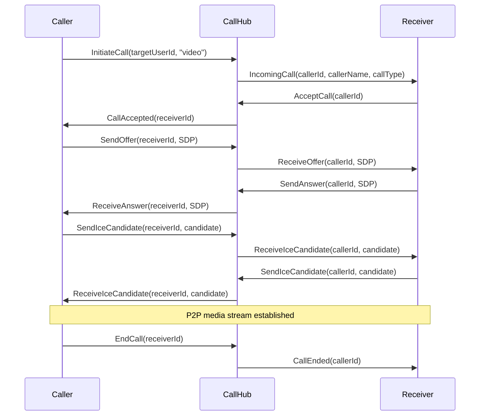

# UI Fixes and Chat Call/Video Feature

## Issue 1: Load User Answers in Profile

The Answers tab on the user profile page currently shows a static placeholder. The backend API already exists at `GET /api/users/{id}/answers` returning `PaginatedResponse<AnswerDto>`.

**Changes:**

- **[frontend/src/lib/api/users.api.ts](frontend/src/lib/api/users.api.ts)** -- Add `getAnswers(userId, page?, pageSize?)` method calling `GET /users/{userId}/answers`
- **[frontend/src/app/(app)/users/[id]/page.tsx](frontend/src/app/(app)/users/[id]/page.tsx)** -- Add `useQuery` for answers data (similar to questions fetch at line 32-35), replace the placeholder block (lines 156-162) with a list of answers. Each answer links to its question (`/questions/{questionId}#answer-{answerId}`), shows body excerpt, score, accepted status, and relative time.

---

## Issue 2: Remove @username from Profile Header

Currently line 84 shows `@{user.username}` below the display name.

**Changes:**

- **[frontend/src/app/(app)/users/[id]/page.tsx](frontend/src/app/(app)/users/[id]/page.tsx)** -- Remove line 84: `
@{user.username}
`

---

## Issue 3: Custom Centered Delete Dialog

Currently uses `window.confirm()` (line 248 of chat/page.tsx) which shows the native browser dialog with the URL bar and verbose message.

**Changes:**

- **Create `frontend/src/components/chat/ConfirmDialog.tsx`** -- A reusable centered modal overlay with:
  - Backdrop (semi-transparent)
  - Centered white card with message text
  - OK / Cancel buttons
  - Props: `isOpen`, `message`, `onConfirm`, `onCancel`
- **[frontend/src/app/(chat)/chat/page.tsx](frontend/src/app/(chat)/chat/page.tsx)** -- Replace `window.confirm(...)` call with state-driven `ConfirmDialog`. Add state `deleteConfirmId` to track which conversation is being deleted. Change message to: `"Ban co chac chan muon xoa doan chat nay?"` (simpler wording).

---

## Issue 4: Implement Chat Action Buttons (Call, Video, Info)

Currently 3 placeholder buttons in [frontend/src/components/chat/MessageList.tsx](frontend/src/components/chat/MessageList.tsx) (lines 68-78) with no `onClick` handlers.

### 4a. Info Panel

Show a slide-out side panel when clicking the info button.

**Changes:**

- **Create `frontend/src/components/chat/ConversationInfoPanel.tsx`** -- Side panel displaying:
  - Participant avatar, display name, online status
  - Conversation creation date
  - Shared media thumbnails (images from message history)
  - Action buttons (mute notifications, block user)
- **[frontend/src/components/chat/MessageList.tsx](frontend/src/components/chat/MessageList.tsx)** -- Add `onInfoClick` callback prop to the info button
- **[frontend/src/app/(chat)/chat/page.tsx](frontend/src/app/(chat)/chat/page.tsx)** -- Add `showInfoPanel` state, render `ConversationInfoPanel` as a right sidebar when active

### 4b. Audio/Video Call (WebRTC + SignalR)

Requires both backend signaling and frontend WebRTC peer connection.

#### Backend

- **Create `backend/src/SocialTechsy.SocialNetwork.Api/Hubs/CallHub.cs`** -- New SignalR hub at `/hubs/call` with methods:
  - `InitiateCall(targetUserId, callType)` -- notify the target user of incoming call
  - `AcceptCall(callerId)` -- signal call accepted
  - `RejectCall(callerId)` -- signal call rejected
  - `EndCall(peerId)` -- signal call ended
  - `SendOffer(peerId, sdp)` -- relay WebRTC SDP offer
  - `SendAnswer(peerId, sdp)` -- relay WebRTC SDP answer
  - `SendIceCandidate(peerId, candidate)` -- relay ICE candidate
- **[backend/src/SocialTechsy.SocialNetwork.Api/Program.cs](backend/src/SocialTechsy.SocialNetwork.Api/Program.cs)** -- Register `/hubs/call` endpoint

#### Frontend

- **Update [frontend/src/lib/signalr/connectionManager.ts](frontend/src/lib/signalr/connectionManager.ts)** -- Add `'call'` to the allowed hub names
- **Create `frontend/src/lib/webrtc/useWebRTC.ts`** -- Custom hook encapsulating:
  - `RTCPeerConnection` lifecycle (create, offer, answer, ICE)
  - `getUserMedia()` for microphone and camera
  - Media stream management (local/remote)
  - Cleanup on call end
  - Uses public STUN servers (`stun:stun.l.google.com:19302`)
- **Create `frontend/src/components/chat/CallOverlay.tsx`** -- Full-screen overlay UI for active calls:
  - Incoming call: ring animation, accept/reject buttons
  - Outgoing call: waiting animation, cancel button
  - Active call: mute mic, toggle camera, end call buttons
  - Video call: local/remote `<video>` elements
  - Audio call: avatar display with call timer
- **[frontend/src/components/chat/MessageList.tsx](frontend/src/components/chat/MessageList.tsx)** -- Add `onAudioCall` and `onVideoCall` callback props
- **[frontend/src/app/(chat)/chat/page.tsx](frontend/src/app/(chat)/chat/page.tsx)** -- Wire call logic:
  - Connect to CallHub via `useHub('call')`
  - Listen for incoming call events
  - Initiate calls on button click
  - Manage call state and render `CallOverlay`

### Architecture Flow

