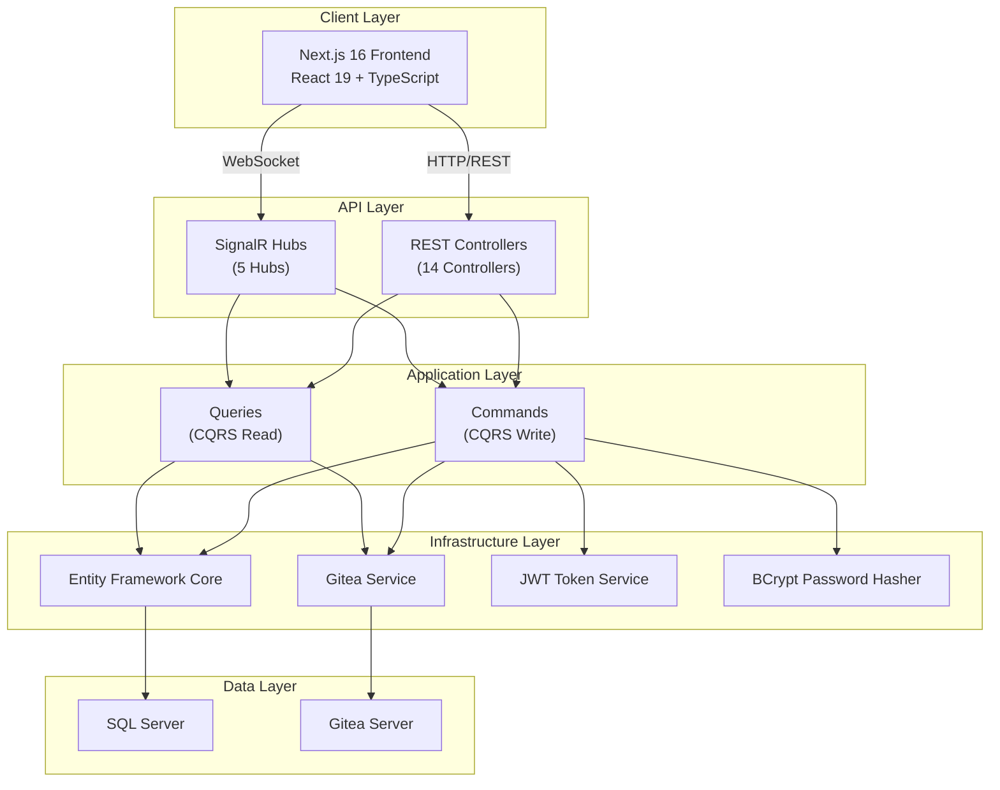
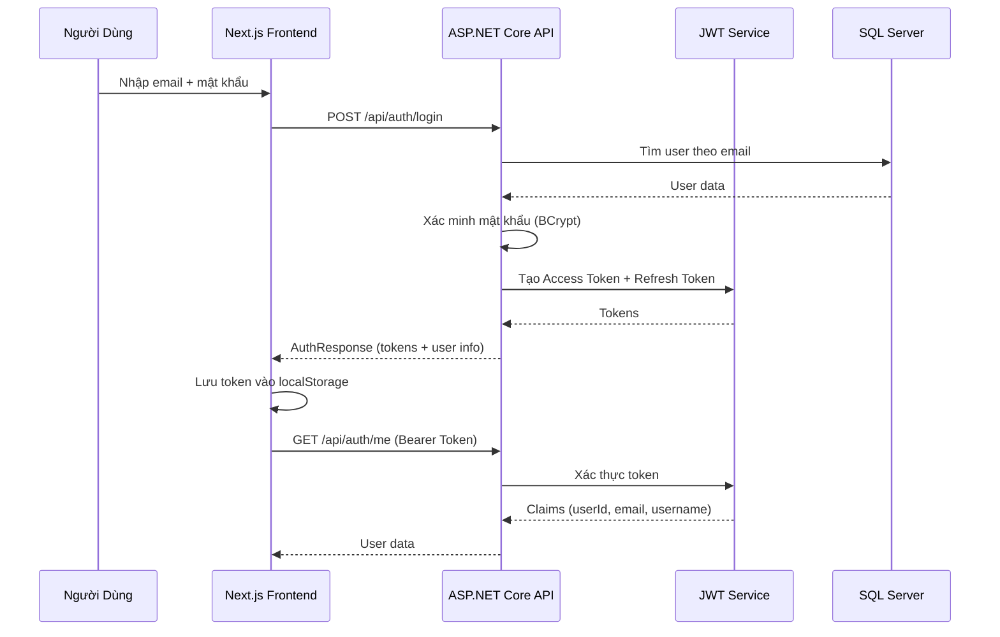
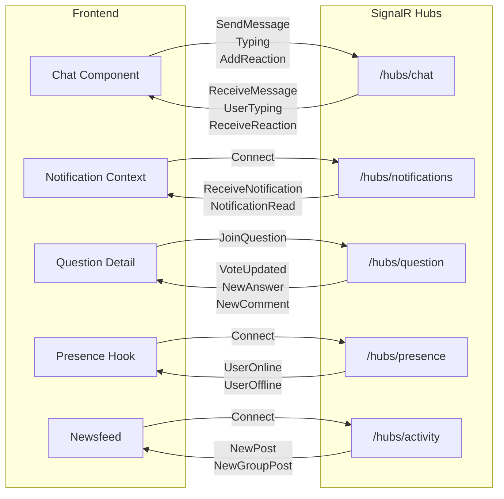
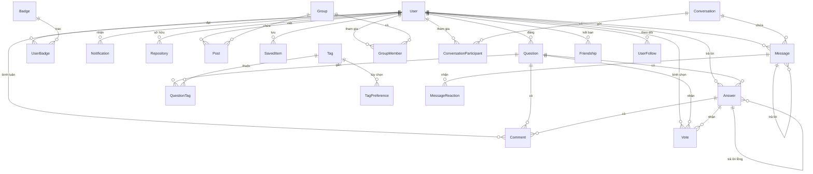

# Tài Liệu Tổng Hợp Tính Năng - SocialTechsy Social Network

> **SocialTechsy Social Network** — Nền tảng mạng xã hội dành cho lập trình viên, kết hợp hệ thống Hỏi-Đáp (Q&A) và mạng xã hội.

---

## Mục Lục

1. [Tổng Quan Dự Án](#1-tổng-quan-dự-án)
2. [Kiến Trúc Hệ Thống](#2-kiến-trúc-hệ-thống)
3. [Tất Cả Tính Năng](#3-tất-cả-tính-năng)
4. [Tính Năng Nổi Bật](#4-tính-năng-nổi-bật)
5. [Tất Cả Màn Hình Chức Năng](#5-tất-cả-màn-hình-chức-năng)
6. [Sơ Đồ Kiến Trúc](#6-sơ-đồ-kiến-trúc)

---

## 1. Tổng Quan Dự Án

**SocialTechsy Social Network** (tên hiển thị: **DevCommunity**) là một nền tảng mạng xã hội chuyên biệt dành cho lập trình viên. Dự án kết hợp hai mô hình:

- **Hỏi-Đáp (Q&A)** theo phong cách StackOverflow — đặt câu hỏi, trả lời, bình chọn, gắn thẻ
- **Mạng xã hội** theo phong cách Facebook — kết bạn, theo dõi, nhóm, bảng tin, chat thời gian thực

### Tech Stack

| Thành phần | Công nghệ |
|------------|-----------|
| **Backend** | ASP.NET Core 8, C# |
| **Frontend** | Next.js 16, React 19, TypeScript |
| **Cơ sở dữ liệu** | SQL Server + Entity Framework Core 8 |
| **Giao tiếp thời gian thực** | SignalR (5 Hub) |
| **Quản lý mã nguồn** | Gitea (tích hợp qua API) |
| **Styling** | Tailwind CSS 4, Bootstrap 5, Bootstrap Icons |
| **Markdown** | react-markdown, remark-gfm, react-syntax-highlighter |
| **HTTP Client** | Axios với interceptor tự động |
| **Xác thực** | JWT Bearer Token |

### Các Pattern và Kiến Trúc

- **Clean Architecture** — Tách biệt rõ ràng giữa Domain, Application, Infrastructure, API
- **CQRS** (Command Query Responsibility Segregation) — Tách lệnh ghi và đọc
- **Repository Pattern** — Truy cập dữ liệu qua interface
- **Dependency Injection** — Quản lý vòng đời service
- **JWT Authentication** — Xác thực không trạng thái (stateless)

---

## 2. Kiến Trúc Hệ Thống

### 2.1 Cấu Trúc Backend (Clean Architecture)

```
backend/src/
├── SocialTechsy.SocialNetwork.Domain          # Entity, Enum — không phụ thuộc
├── SocialTechsy.SocialNetwork.Application     # CQRS Handler, DTO, Interface
├── SocialTechsy.SocialNetwork.Infrastructure  # EF Core, Repository, Gitea Service
├── SocialTechsy.SocialNetwork.Api             # Controller, SignalR Hub, Program.cs
└── SocialTechsy.SocialNetwork.Shared          # Code dùng chung
```

### 2.2 Cấu Trúc Frontend (Next.js App Router)

```
frontend/src/
├── app/                    # Các trang (App Router)
│   ├── auth/               # Đăng nhập, Đăng ký
│   ├── questions/           # Câu hỏi (danh sách, chi tiết, tạo, sửa, xóa)
│   ├── tags/               # Thẻ
│   ├── users/              # Người dùng
│   ├── newsfeed/           # Bảng tin
│   ├── groups/             # Nhóm
│   ├── friends/            # Bạn bè
│   ├── chat/               # Chat
│   ├── saved/              # Đã lưu
│   ├── notifications/      # Thông báo
│   ├── repositories/       # Repository mã nguồn
│   ├── search/             # Tìm kiếm
│   ├── settings/           # Cài đặt
│   └── profile/            # Hồ sơ cá nhân
├── components/             # Component dùng chung
├── contexts/               # React Context (Auth, Notification)
├── services/               # API service layer
└── hooks/                  # Custom hooks (SignalR, v.v.)
```

### 2.3 Các Entity Chính Trong Cơ Sở Dữ Liệu

| Entity | Mô tả |
|--------|--------|
| **User** | Người dùng — Username, Email, DisplayName, Bio, Location, Website, ProfilePicture, ReputationPoints, IsEmailVerified |
| **Question** | Câu hỏi — Title, Body (Markdown), ViewCount, Score, Status |
| **Answer** | Câu trả lời — Body, Score, IsAccepted, hỗ trợ trả lời lồng nhau (ParentAnswerId) |
| **Comment** | Bình luận — Gắn với câu hỏi hoặc câu trả lời |
| **Vote** | Bình chọn — Upvote/Downvote cho câu hỏi hoặc câu trả lời |
| **Tag** | Thẻ — TagName, Description, UsageCount |
| **QuestionTag** | Quan hệ nhiều-nhiều giữa Question và Tag |
| **Badge** | Huy hiệu — Name, Description, IconUrl, BadgeType, RequiredPoints |
| **UserBadge** | Huy hiệu đã đạt của người dùng |
| **Notification** | Thông báo — Type, Message, Link, IsRead |
| **Repository** | Repository mã nguồn — GiteaRepoId, CloneUrl, DefaultBranch, StarCount, ForkCount |
| **Conversation** | Cuộc hội thoại — Title, IsGroupChat |
| **ConversationParticipant** | Thành viên cuộc hội thoại |
| **Message** | Tin nhắn — Content, MessageType, AttachmentUrl, ReplyToMessageId |
| **MessageReaction** | Phản ứng tin nhắn — like, love, haha, wow, sad, angry |
| **Friendship** | Kết bạn — Requester, Addressee, Status (Pending/Accepted/Rejected) |
| **UserFollow** | Theo dõi — Follower, Following |
| **Group** | Nhóm — Name, Description, CoverImage, IsPrivate |
| **GroupMember** | Thành viên nhóm — Role (Member/Moderator/Admin) |
| **Post** | Bài viết — Content, AuthorId, GroupId |
| **TagPreference** | Tùy chọn thẻ — IsFollowed, IsIgnored |
| **SavedItem** | Mục đã lưu — QuestionId hoặc AnswerId |
| **Attachment** | Tệp đính kèm — FileName, ContentType, FilePath, FileSize |

---

## 3. Tất Cả Tính Năng

### 3.1 Hệ Thống Hỏi-Đáp (Q&A)

#### 3.1.1 Quản Lý Câu Hỏi
- Tạo câu hỏi mới với tiêu đề, nội dung Markdown và gắn thẻ (tags)
- Chỉnh sửa câu hỏi đã đăng (chỉ tác giả)
- Xóa câu hỏi với xác nhận gõ "DELETE"
- Xem chi tiết câu hỏi với đếm lượt xem (ViewCount)
- Sắp xếp danh sách câu hỏi theo: Mới nhất, Hoạt động, Chưa trả lời, Nhiều bình chọn
- Lọc câu hỏi theo thẻ (tag)
- Tìm kiếm câu hỏi theo từ khóa
- Phân trang danh sách câu hỏi
- Markdown editor với toolbar hỗ trợ (bold, italic, code, link, v.v.)

#### 3.1.2 Quản Lý Câu Trả Lời
- Viết câu trả lời cho câu hỏi (Markdown)
- Chỉnh sửa câu trả lời đã đăng
- Xóa câu trả lời
- Chấp nhận câu trả lời tốt nhất (chỉ tác giả câu hỏi)
- Trả lời lồng nhau (reply to answer) qua ParentAnswerId
- Hiển thị điểm (Score) cho mỗi câu trả lời

#### 3.1.3 Bình Luận
- Bình luận trên câu hỏi
- Bình luận trên câu trả lời
- Chỉnh sửa bình luận
- Xóa bình luận

#### 3.1.4 Bình Chọn (Voting)
- Upvote / Downvote câu hỏi
- Upvote / Downvote câu trả lời
- Hủy bình chọn
- Cập nhật điểm (Score) theo thời gian thực qua SignalR (`QuestionHub`)
- Mỗi người dùng chỉ được bình chọn 1 lần cho mỗi câu hỏi/câu trả lời

#### 3.1.5 Hệ Thống Thẻ (Tags)
- Duyệt danh sách thẻ với tìm kiếm
- Xem câu hỏi theo thẻ
- Theo dõi thẻ (Follow) — nhận cập nhật về câu hỏi mới
- Ẩn thẻ (Ignore) — không hiển thị câu hỏi có thẻ này
- Xem mô tả và số lượng sử dụng (UsageCount) của thẻ
- Quản lý tùy chọn thẻ cá nhân

#### 3.1.6 Lưu Câu Hỏi / Câu Trả Lời
- Lưu câu hỏi để đọc sau
- Lưu câu trả lời hay
- Bỏ lưu
- Xem danh sách các mục đã lưu với bộ lọc

---

### 3.2 Mạng Xã Hội

#### 3.2.1 Hồ Sơ Người Dùng
- Thông tin cá nhân: Display Name, Bio, Location, Website
- Ảnh đại diện (Profile Picture)
- Điểm uy tín (Reputation Points)
- Xem danh sách câu hỏi đã đăng
- Xem danh sách câu trả lời đã đăng
- Xem huy hiệu đã đạt
- Thống kê: số người theo dõi, đang theo dõi

#### 3.2.2 Hệ Thống Kết Bạn
- Gửi lời mời kết bạn
- Chấp nhận lời mời kết bạn
- Từ chối lời mời kết bạn
- Hủy kết bạn
- Xem danh sách bạn bè
- Xem lời mời đang chờ (nhận được)
- Xem lời mời đã gửi
- Kiểm tra trạng thái kết bạn với người khác

#### 3.2.3 Theo Dõi Người Dùng (Follow)
- Theo dõi (Follow) người dùng
- Hủy theo dõi (Unfollow)
- Xem danh sách người theo dõi (Followers)
- Xem danh sách đang theo dõi (Following)
- Xem thống kê theo dõi (Follow Stats)
- Kiểm tra trạng thái theo dõi

#### 3.2.4 Nhóm (Groups)
- Tạo nhóm mới (tên, mô tả, ảnh bìa, công khai/riêng tư)
- Tham gia nhóm
- Rời nhóm
- Cập nhật thông tin nhóm (chỉ Admin)
- Xóa nhóm (chỉ Admin)
- Xem danh sách nhóm với phân trang
- Xem nhóm đã tham gia ("My Groups")
- Phân quyền thành viên: **Member** / **Moderator** / **Admin**
- Thay đổi vai trò thành viên
- Xóa thành viên khỏi nhóm

#### 3.2.5 Bảng Tin (Newsfeed)
- Xem bảng tin tổng hợp (bài viết từ bạn bè và nhóm)
- Tạo bài viết mới
- Chỉnh sửa bài viết
- Xóa bài viết
- Xem bài viết theo nhóm
- Xem bài viết theo người dùng
- Cập nhật bảng tin thời gian thực qua SignalR (`ActivityHub`)

---

### 3.3 Chat Thời Gian Thực

#### 3.3.1 Nhắn Tin
- Chat 1-1 (cá nhân)
- Chat nhóm (Group Chat)
- Bắt đầu cuộc hội thoại mới
- Gửi tin nhắn văn bản
- Gửi tin nhắn đa phương tiện (ảnh, video, âm thanh, tài liệu)
- Trả lời tin nhắn cụ thể (Reply)
- Phân trang tin nhắn (load thêm tin nhắn cũ)

#### 3.3.2 Phản Ứng Tin Nhắn (Reactions)
- 6 loại phản ứng: Like, Love, Haha, Wow, Sad, Angry
- Thêm phản ứng cho tin nhắn
- Xóa phản ứng
- Hiển thị phản ứng theo thời gian thực

#### 3.3.3 Trạng Thái & Tương Tác
- Trạng thái đang gõ (Typing Indicator)
- Trạng thái online/offline của người dùng (qua `PresenceHub`)
- Đánh dấu tin nhắn đã đọc
- Hiển thị thời gian đọc cuối cùng (LastReadDate)
- Widget chat nổi (Floating Chat Widget) ở góc màn hình

#### 3.3.4 Đa Phương Tiện
- Chọn file từ thiết bị (MediaPicker)
- Xem trước file trước khi gửi (MediaPreview)
- Xem ảnh/video toàn màn hình (MediaLightbox)
- Hỗ trợ: ảnh, video, âm thanh, tệp tài liệu

---

### 3.4 Quản Lý Mã Nguồn (Tích Hợp Gitea)

#### 3.4.1 Repository
- Tạo repository mới (tên, mô tả, công khai/riêng tư)
- Cập nhật thông tin repository
- Xóa repository
- Xem danh sách repository (toàn bộ, phân trang)
- Xem repository của tôi ("My Repositories")
- Thông tin: StarCount, ForkCount, DefaultBranch, CloneUrl

#### 3.4.2 Duyệt Mã Nguồn
- Duyệt cây thư mục (file tree) từ Gitea
- Xem nội dung file với syntax highlighting (Prism.js)
- Xem file README tự động
- Điều hướng qua các thư mục con

#### 3.4.3 Lịch Sử & Nhánh
- Xem lịch sử commit
- Xem chi tiết từng commit
- Xem danh sách nhánh (branches)

---

### 3.5 Gamification (Trò Chơi Hóa)

#### 3.5.1 Điểm Uy Tín (Reputation Points)
- Tích lũy điểm qua hoạt động (câu hỏi, câu trả lời, bình chọn)
- Hiển thị điểm trên hồ sơ người dùng
- Bảng xếp hạng người đóng góp nhiều nhất (Top Contributors trên Right Sidebar)

#### 3.5.2 Huy Hiệu (Badges)
- Hệ thống huy hiệu đa cấp (BadgeType)
- Đạt huy hiệu khi đủ điểm yêu cầu (RequiredPoints)
- Xem danh sách tất cả huy hiệu
- Xem chi tiết huy hiệu
- Xem người dùng đã đạt huy hiệu
- Hiển thị huy hiệu trên hồ sơ cá nhân

---

### 3.6 Thông Báo

- Thông báo thời gian thực qua SignalR (`NotificationHub`)
- Các loại thông báo: câu trả lời mới, bình luận mới, bình chọn, kết bạn, v.v.
- Đánh dấu đã đọc (từng thông báo)
- Đánh dấu tất cả đã đọc
- Xóa thông báo
- Đếm thông báo chưa đọc (hiển thị trên navbar)
- Biểu tượng chuông thông báo với badge đếm số

---

### 3.7 Xác Thực & Bảo Mật

#### 3.7.1 Đăng Ký / Đăng Nhập
- Đăng ký tài khoản (Username, Email, Password)
- Đăng nhập bằng Email + Password
- Mật khẩu được hash bằng BCrypt
- JWT Token với thời hạn cấu hình được

#### 3.7.2 Quản Lý Phiên
- Access Token + Refresh Token
- Tự động refresh token khi hết hạn (Axios interceptor)
- Đăng xuất xóa token

#### 3.7.3 Quên / Đặt Lại Mật Khẩu
- Gửi email đặt lại mật khẩu
- Đặt lại mật khẩu bằng token

---

### 3.8 Tìm Kiếm

- Tìm kiếm toàn cục (Global Search)
- Tìm kiếm câu hỏi theo tiêu đề/nội dung
- Tìm kiếm người dùng theo tên
- Tìm kiếm thẻ theo tên
- Thanh tìm kiếm trên Navbar
- Trang kết quả tìm kiếm với phân loại

---

### 3.9 Upload File

- Upload file đơn
- Upload nhiều file cùng lúc
- Hỗ trợ ảnh, video, tài liệu
- Sử dụng trong chat và bài viết

---

### 3.10 Giao Diện & Trải Nghiệm Người Dùng

#### 3.10.1 Dark Mode / Light Mode
- Chuyển đổi giao diện sáng/tối
- Lưu tùy chọn vào localStorage
- Toggle trên Navbar

#### 3.10.2 Responsive Design
- Tương thích đa thiết bị (desktop, tablet, mobile)
- Sidebar tự động ẩn trên mobile
- Tailwind CSS breakpoints

#### 3.10.3 Hiệu Ứng & Hoạt Ảnh
- AOS (Animate On Scroll) — hiệu ứng khi cuộn
- Fade-in, slide animation
- Typing dots animation trong chat
- Hỗ trợ `prefers-reduced-motion` cho người dùng nhạy cảm với chuyển động

#### 3.10.4 Layout
- **ModernNavbar** — thanh điều hướng cố định trên cùng: logo, tìm kiếm, dark mode, tạo mới, thông báo, menu người dùng
- **ModernSidebar** — thanh bên trái thu gọn được, phân nhóm: Main, Social, Personal
- **RightSidebar** — thanh bên phải: Trending Topics, Top Contributors, Quick Actions
- **ModernFooter** — chân trang

---

## 4. Tính Năng Nổi Bật

### 4.1 Kết Hợp Q&A và Mạng Xã Hội
Dự án là sự kết hợp độc đáo giữa nền tảng Hỏi-Đáp (kiểu StackOverflow) và mạng xã hội (kiểu Facebook) dành riêng cho lập trình viên. Người dùng vừa có thể đặt câu hỏi kỹ thuật, vừa có thể kết bạn, tham gia nhóm, và chia sẻ bài viết.

### 4.2 Chat Thời Gian Thực Đầy Đủ Tính Năng
Hệ thống chat được xây dựng hoàn chỉnh với SignalR, bao gồm:
- Nhắn tin 1-1 và nhóm
- Gửi file đa phương tiện (ảnh, video, tài liệu)
- 6 loại phản ứng cảm xúc (emoji reactions)
- Trả lời tin nhắn cụ thể
- Trạng thái đang gõ và online/offline
- Widget chat nổi cho truy cập nhanh

### 4.3 Tích Hợp Gitea — Quản Lý Mã Nguồn
Tích hợp trực tiếp với Gitea để cung cấp tính năng quản lý mã nguồn:
- Tạo và quản lý repository
- Duyệt file/thư mục trực tiếp trên web
- Xem nội dung file với syntax highlighting
- Xem lịch sử commit và nhánh

### 4.4 Hệ Thống 5 SignalR Hub Thời Gian Thực
Dự án sử dụng **5 SignalR Hub** riêng biệt cho từng loại giao tiếp thời gian thực:

| Hub | Đường dẫn | Chức năng |
|-----|-----------|-----------|
| **ChatHub** | `/hubs/chat` | Nhắn tin, gõ chữ, phản ứng, đánh dấu đã đọc |
| **NotificationHub** | `/hubs/notifications` | Thông báo thời gian thực |
| **QuestionHub** | `/hubs/question` | Cập nhật câu hỏi (câu trả lời mới, bình luận, bình chọn) |
| **PresenceHub** | `/hubs/presence` | Trạng thái online/offline |
| **ActivityHub** | `/hubs/activity` | Bảng tin, bài viết mới |

### 4.5 Markdown Editor Với Toolbar
Trình soạn thảo Markdown tích hợp toolbar hỗ trợ:
- Định dạng văn bản (bold, italic, heading)
- Chèn code block với syntax highlighting
- Chèn link, ảnh
- Xem trước (preview) nội dung Markdown
- Hỗ trợ GitHub Flavored Markdown (GFM)

### 4.6 Hệ Thống Gamification
Trò chơi hóa trải nghiệm với điểm uy tín và huy hiệu, khuyến khích người dùng đóng góp tích cực cho cộng đồng.

---

## 5. Tất Cả Màn Hình Chức Năng

### 5.1 Màn Hình Công Khai (Không Cần Đăng Nhập)

| # | Màn Hình | Route | Mô Tả Chi Tiết |
|---|----------|-------|-----------------|
| 1 | **Trang Chủ** | `/` | Hiển thị câu hỏi gần đây, thống kê hero (nếu đã đăng nhập), banner chào mừng (nếu chưa đăng nhập) |
| 2 | **Đăng Nhập / Đăng Ký** | `/auth` | Form đăng nhập (email, mật khẩu) và đăng ký (tên, email, mật khẩu, xác nhận, điều khoản). Chuyển đổi qua `?mode=login` hoặc `?mode=register` |
| 3 | **Quên Mật Khẩu** | `/forgot-password` | Form nhập email để nhận liên kết đặt lại mật khẩu |
| 4 | **Đặt Lại Mật Khẩu** | `/reset-password` | Form nhập mật khẩu mới với token xác thực |
| 5 | **Danh Sách Câu Hỏi** | `/questions` | Danh sách câu hỏi với sắp xếp (mới nhất, hoạt động, chưa trả lời, nhiều bình chọn), tìm kiếm, lọc theo thẻ, phân trang |
| 6 | **Chi Tiết Câu Hỏi** | `/questions/[id]` | Nội dung câu hỏi, danh sách câu trả lời, bình luận, bình chọn, lưu câu hỏi. Cập nhật thời gian thực qua SignalR |
| 7 | **Danh Sách Thẻ** | `/tags` | Duyệt tất cả thẻ với tìm kiếm, hiển thị mô tả và số lượng sử dụng |
| 8 | **Danh Sách Người Dùng** | `/users` | Danh sách thành viên cộng đồng, nút theo dõi và kết bạn |
| 9 | **Hồ Sơ Người Dùng** | `/users/[id]` | Thông tin hồ sơ, câu hỏi đã đăng, câu trả lời, huy hiệu, phần "Giới thiệu" |
| 10 | **Tìm Kiếm** | `/search?q=X` | Kết quả tìm kiếm phân loại: câu hỏi, người dùng, thẻ |
| 11 | **Danh Sách Repository** | `/repositories` | Duyệt repository công khai, tìm kiếm, thông tin star/fork |
| 12 | **Chi Tiết Repository** | `/repositories/[id]` | Thông tin repository, file README, cây file, nhánh mặc định |
| 13 | **Duyệt File Repository** | `/repositories/[id]/files/[[...path]]` | Duyệt thư mục và xem nội dung file với syntax highlighting |
| 14 | **Lịch Sử Commit** | `/repositories/[id]/commits` | Danh sách commit với thông tin tác giả, thời gian, message |
| 15 | **Danh Sách Nhánh** | `/repositories/[id]/branches` | Danh sách nhánh (branches) của repository |
| 16 | **Danh Sách Nhóm** | `/groups` | Duyệt nhóm, tìm kiếm, tham gia, tạo nhóm mới |
| 17 | **Chi Tiết Nhóm** | `/groups/[id]` | Thông tin nhóm, danh sách bài viết, tham gia/rời nhóm |

### 5.2 Màn Hình Yêu Cầu Đăng Nhập

| # | Màn Hình | Route | Mô Tả Chi Tiết |
|---|----------|-------|-----------------|
| 18 | **Đặt Câu Hỏi** | `/questions/ask` | Form tạo câu hỏi: tiêu đề, nội dung (Markdown editor với toolbar), chọn thẻ |
| 19 | **Sửa Câu Hỏi** | `/questions/[id]/edit` | Form chỉnh sửa câu hỏi với Markdown toolbar, chỉ tác giả truy cập được |
| 20 | **Xóa Câu Hỏi** | `/questions/[id]/delete` | Trang xác nhận xóa — yêu cầu gõ "DELETE" để xác nhận |
| 21 | **Bảng Tin** | `/newsfeed` | Hiển thị bài viết từ bạn bè và nhóm, tạo bài viết mới, cập nhật thời gian thực |
| 22 | **Bạn Bè** | `/friends` | Danh sách bạn bè, lời mời đang chờ, chấp nhận/từ chối lời mời |
| 23 | **Chat** | `/chat` | Giao diện chat toàn màn hình: danh sách hội thoại, cửa sổ chat, gửi tin nhắn/media, phản ứng, trả lời |
| 24 | **Đã Lưu** | `/saved` | Danh sách câu hỏi và câu trả lời đã lưu, bộ lọc theo loại |
| 25 | **Hồ Sơ Cá Nhân** | `/profile` | Hồ sơ của người dùng hiện tại, thống kê, huy hiệu |
| 26 | **Cài Đặt** | `/settings` | Cài đặt tài khoản: hồ sơ (tên, email, bio, location, website), đổi mật khẩu, tùy chọn thông báo, giao diện (theme) |
| 27 | **Thông Báo** | `/notifications` | Danh sách thông báo, đánh dấu đã đọc, đánh dấu tất cả đã đọc |
| 28 | **Tùy Chọn Thẻ** | `/tags/preferences` | Quản lý thẻ theo dõi (Watched) và thẻ ẩn (Ignored) |
| 29 | **Tạo Repository** | `/repositories/create` | Form tạo repository mới: tên, mô tả, công khai/riêng tư |
| 30 | **Repository Của Tôi** | `/repositories/my` | Danh sách repository do người dùng hiện tại sở hữu |

### 5.3 Component Giao Diện Chung

| Component | Mô Tả |
|-----------|--------|
| **ModernNavbar** | Thanh điều hướng cố định trên cùng — logo, thanh tìm kiếm, toggle dark mode, nút tạo mới, chuông thông báo (badge đếm số), menu dropdown người dùng |
| **ModernSidebar** | Thanh bên trái thu gọn được — phân 3 nhóm: **Main** (Trang chủ, Câu hỏi, Thẻ, Người dùng), **Social** (Bảng tin, Nhóm, Bạn bè), **Personal** (Chat, Đã lưu, Thẻ của tôi) |
| **RightSidebar** | Thanh bên phải — Trending Topics, Top Contributors, Quick Actions |
| **ChatWidget** | Widget chat nổi ở góc màn hình — truy cập nhanh chat mà không cần rời trang |
| **MarkdownContent** | Hiển thị nội dung Markdown với syntax highlighting cho code blocks |
| **MediaPicker** | Chọn file đa phương tiện để gửi trong chat |
| **MediaPreview** | Xem trước file trước khi gửi |
| **MediaLightbox** | Xem ảnh/video toàn màn hình |
| **ReactionPicker** | Chọn phản ứng cảm xúc cho tin nhắn |

---

## 6. Sơ Đồ Kiến Trúc

### 6.1 Kiến Trúc Tổng Thể



### 6.2 Luồng Xác Thực



### 6.3 Hệ Thống SignalR Hub



### 6.4 Sơ Đồ Quan Hệ Entity Chính



---

## 7. API Endpoints Tổng Hợp

### 7.1 Xác Thực (`/api/auth`)

| Method | Route | Auth | Chức năng |
|--------|-------|------|-----------|
| POST | `/api/auth/register` | Không | Đăng ký tài khoản |
| POST | `/api/auth/login` | Không | Đăng nhập |
| POST | `/api/auth/refresh` | Không | Làm mới token |
| POST | `/api/auth/logout` | Có | Đăng xuất |
| GET | `/api/auth/me` | Có | Lấy thông tin người dùng hiện tại |

### 7.2 Người Dùng (`/api/users`)

| Method | Route | Auth | Chức năng |
|--------|-------|------|-----------|
| GET | `/api/users` | Không | Danh sách người dùng (phân trang) |
| GET | `/api/users/{id}` | Không | Chi tiết người dùng |
| GET | `/api/users/{id}/questions` | Không | Câu hỏi của người dùng |
| GET | `/api/users/{id}/answers` | Không | Câu trả lời của người dùng |
| GET | `/api/users/{id}/badges` | Không | Huy hiệu của người dùng |

### 7.3 Câu Hỏi (`/api/questions`)

| Method | Route | Auth | Chức năng |
|--------|-------|------|-----------|
| GET | `/api/questions` | Không | Danh sách câu hỏi (phân trang, sắp xếp, lọc) |
| GET | `/api/questions/{id}` | Không | Chi tiết câu hỏi |
| POST | `/api/questions` | Có | Tạo câu hỏi |
| PUT | `/api/questions/{id}` | Có | Sửa câu hỏi |
| DELETE | `/api/questions/{id}` | Có | Xóa câu hỏi |

### 7.4 Câu Trả Lời (`/api/answers`)

| Method | Route | Auth | Chức năng |
|--------|-------|------|-----------|
| GET | `/api/answers/question/{questionId}` | Không | Câu trả lời theo câu hỏi |
| GET | `/api/answers/{id}` | Không | Chi tiết câu trả lời |
| POST | `/api/answers` | Có | Tạo câu trả lời |
| PUT | `/api/answers/{id}` | Có | Sửa câu trả lời |
| DELETE | `/api/answers/{id}` | Có | Xóa câu trả lời |
| POST | `/api/answers/{id}/accept` | Có | Chấp nhận câu trả lời |

### 7.5 Bình Luận (`/api/comments`)

| Method | Route | Auth | Chức năng |
|--------|-------|------|-----------|
| POST | `/api/comments/question/{questionId}` | Có | Bình luận câu hỏi |
| POST | `/api/comments/answer/{answerId}` | Có | Bình luận câu trả lời |
| PUT | `/api/comments/{id}` | Có | Sửa bình luận |
| DELETE | `/api/comments/{id}` | Có | Xóa bình luận |

### 7.6 Bình Chọn (`/api/votes`)

| Method | Route | Auth | Chức năng |
|--------|-------|------|-----------|
| POST | `/api/votes/question/{questionId}` | Có | Bình chọn câu hỏi |
| POST | `/api/votes/answer/{answerId}` | Có | Bình chọn câu trả lời |
| DELETE | `/api/votes/question/{questionId}` | Có | Hủy bình chọn câu hỏi |
| DELETE | `/api/votes/answer/{answerId}` | Có | Hủy bình chọn câu trả lời |

### 7.7 Thẻ (`/api/tags`)

| Method | Route | Auth | Chức năng |
|--------|-------|------|-----------|
| GET | `/api/tags` | Không | Danh sách thẻ |
| GET | `/api/tags/{tagName}` | Không | Chi tiết thẻ |
| GET | `/api/tags/{tagName}/questions` | Không | Câu hỏi theo thẻ |
| GET | `/api/tags/preferences` | Có | Tùy chọn thẻ của tôi |
| GET | `/api/tags/preferences/followed` | Có | Thẻ đang theo dõi |
| POST | `/api/tags/{tagId}/follow` | Có | Theo dõi thẻ |
| POST | `/api/tags/{tagId}/ignore` | Có | Ẩn thẻ |
| DELETE | `/api/tags/{tagId}/preference` | Có | Xóa tùy chọn thẻ |

### 7.8 Chat (`/api/chat`)

| Method | Route | Auth | Chức năng |
|--------|-------|------|-----------|
| GET | `/api/chat/conversations` | Có | Danh sách hội thoại |
| GET | `/api/chat/conversations/{id}` | Có | Chi tiết hội thoại |
| GET | `/api/chat/conversations/{id}/messages` | Có | Tin nhắn (phân trang) |
| POST | `/api/chat/conversations` | Có | Bắt đầu hội thoại |
| POST | `/api/chat/conversations/{id}/messages` | Có | Gửi tin nhắn |
| PUT | `/api/chat/conversations/{id}/read` | Có | Đánh dấu đã đọc |
| POST | `/api/chat/messages/{messageId}/reactions` | Có | Thêm phản ứng |
| DELETE | `/api/chat/messages/{messageId}/reactions` | Có | Xóa phản ứng |

### 7.9 Theo Dõi (`/api/follow`)

| Method | Route | Auth | Chức năng |
|--------|-------|------|-----------|
| GET | `/api/follow/followers/{userId}` | Không | Người theo dõi |
| GET | `/api/follow/following/{userId}` | Không | Đang theo dõi |
| GET | `/api/follow/stats/{userId}` | Không | Thống kê theo dõi |
| POST | `/api/follow/{targetUserId}` | Có | Theo dõi |
| DELETE | `/api/follow/{targetUserId}` | Có | Hủy theo dõi |
| GET | `/api/follow/check/{targetUserId}` | Có | Kiểm tra theo dõi |

### 7.10 Kết Bạn (`/api/friendship`)

| Method | Route | Auth | Chức năng |
|--------|-------|------|-----------|
| GET | `/api/friendship/friends` | Có | Danh sách bạn bè |
| GET | `/api/friendship/requests/pending` | Có | Lời mời đang chờ |
| GET | `/api/friendship/requests/sent` | Có | Lời mời đã gửi |
| POST | `/api/friendship/request/{targetUserId}` | Có | Gửi lời mời |
| PUT | `/api/friendship/accept/{friendshipId}` | Có | Chấp nhận |
| PUT | `/api/friendship/reject/{friendshipId}` | Có | Từ chối |
| DELETE | `/api/friendship/{friendshipId}` | Có | Hủy kết bạn |
| GET | `/api/friendship/check/{targetUserId}` | Có | Kiểm tra kết bạn |

### 7.11 Nhóm (`/api/groups`)

| Method | Route | Auth | Chức năng |
|--------|-------|------|-----------|
| GET | `/api/groups` | Không | Danh sách nhóm |
| GET | `/api/groups/my-groups` | Có | Nhóm đã tham gia |
| GET | `/api/groups/{id}` | Không | Chi tiết nhóm |
| GET | `/api/groups/{id}/members` | Có | Thành viên nhóm |
| POST | `/api/groups` | Có | Tạo nhóm |
| PUT | `/api/groups/{id}` | Có | Sửa nhóm |
| DELETE | `/api/groups/{id}` | Có | Xóa nhóm |
| POST | `/api/groups/{id}/join` | Có | Tham gia nhóm |
| POST | `/api/groups/{id}/leave` | Có | Rời nhóm |
| PUT | `/api/groups/{id}/members/{memberId}/role` | Có | Đổi vai trò |
| DELETE | `/api/groups/{id}/members/{memberId}` | Có | Xóa thành viên |

### 7.12 Bảng Tin (`/api/newsfeed`)

| Method | Route | Auth | Chức năng |
|--------|-------|------|-----------|
| GET | `/api/newsfeed` | Có | Bảng tin tổng hợp |
| GET | `/api/newsfeed/groups/{groupId}` | Có | Bài viết nhóm |
| GET | `/api/newsfeed/users/{targetUserId}` | Không | Bài viết người dùng |
| GET | `/api/newsfeed/posts/{postId}` | Không | Chi tiết bài viết |
| POST | `/api/newsfeed/posts` | Có | Tạo bài viết |
| PUT | `/api/newsfeed/posts/{postId}` | Có | Sửa bài viết |
| DELETE | `/api/newsfeed/posts/{postId}` | Có | Xóa bài viết |

### 7.13 Đã Lưu (`/api/saveditems`)

| Method | Route | Auth | Chức năng |
|--------|-------|------|-----------|
| GET | `/api/saveditems` | Có | Danh sách đã lưu |
| POST | `/api/saveditems/questions/{questionId}` | Có | Lưu câu hỏi |
| DELETE | `/api/saveditems/questions/{questionId}` | Có | Bỏ lưu câu hỏi |
| POST | `/api/saveditems/answers/{answerId}` | Có | Lưu câu trả lời |
| DELETE | `/api/saveditems/answers/{answerId}` | Có | Bỏ lưu câu trả lời |

### 7.14 Thông Báo (`/api/notifications`)

| Method | Route | Auth | Chức năng |
|--------|-------|------|-----------|
| GET | `/api/notifications` | Có | Danh sách thông báo |
| GET | `/api/notifications/unread-count` | Có | Số thông báo chưa đọc |
| PUT | `/api/notifications/{id}/read` | Có | Đánh dấu đã đọc |
| PUT | `/api/notifications/read-all` | Có | Đánh dấu tất cả đã đọc |
| DELETE | `/api/notifications/{id}` | Có | Xóa thông báo |

### 7.15 Tìm Kiếm (`/api/search`)

| Method | Route | Auth | Chức năng |
|--------|-------|------|-----------|
| GET | `/api/search` | Không | Tìm kiếm toàn cục (câu hỏi, người dùng, thẻ) |

### 7.16 Repository (`/api/repositories`)

| Method | Route | Auth | Chức năng |
|--------|-------|------|-----------|
| GET | `/api/repositories` | Không | Danh sách repository |
| GET | `/api/repositories/{id}` | Không | Chi tiết repository |
| GET | `/api/repositories/{id}/files` | Không | Cây file (Gitea) |
| GET | `/api/repositories/{id}/files/content` | Không | Nội dung file (Gitea) |
| GET | `/api/repositories/{id}/commits` | Không | Lịch sử commit (Gitea) |
| POST | `/api/repositories` | Có | Tạo repository |
| PUT | `/api/repositories/{id}` | Có | Sửa repository |
| DELETE | `/api/repositories/{id}` | Có | Xóa repository |

### 7.17 Upload Media (`/api/media`)

| Method | Route | Auth | Chức năng |
|--------|-------|------|-----------|
| POST | `/api/media/upload` | Có | Upload file |
| POST | `/api/media/upload-multiple` | Có | Upload nhiều file |

### 7.18 Huy Hiệu (`/api/badges`)

| Method | Route | Auth | Chức năng |
|--------|-------|------|-----------|
| GET | `/api/badges` | Không | Danh sách huy hiệu |
| GET | `/api/badges/{id}` | Không | Chi tiết huy hiệu |
| GET | `/api/badges/{id}/users` | Không | Người dùng đạt huy hiệu |

---

## 8. Tổng Kết

| Hạng mục | Số lượng |
|----------|----------|
| **Tổng số tính năng chính** | 10 nhóm |
| **Tổng số màn hình** | ~30 màn hình |
| **Tổng số API endpoint** | ~80 endpoint |
| **Tổng số SignalR Hub** | 5 hub |
| **Tổng số Entity** | 22 entity |
| **Tổng số Controller** | 14 controller |

**SocialTechsy Social Network** là một dự án full-stack hoàn chỉnh, kết hợp đầy đủ tính năng của một nền tảng Q&A và mạng xã hội dành cho lập trình viên, với hệ thống giao tiếp thời gian thực mạnh mẽ và tích hợp quản lý mã nguồn qua Gitea.
